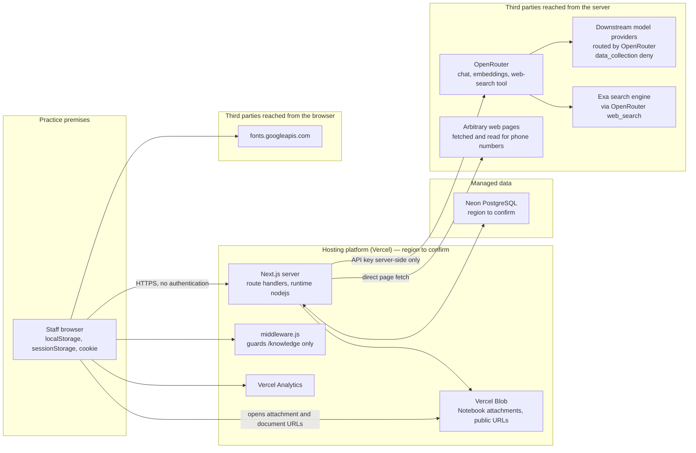

# Architecture — Riverside Helpdesk

**Purpose of this document.** A complete, factual description of what this system
is built from, where every piece of data goes, who processes it and where it is
stored. It is written to be the technical basis for the practice's **Data
Protection Impact Assessment** (`lib/dpia.js`, rendered at `/dpia`), so it
favours completeness over brevity and states what is *not* known as plainly as
what is.

Everything below was read from the code in this repository. Where a fact cannot
be established from the repository alone (hosting account settings, database
region, repository visibility), it is marked **[to confirm]** rather than
guessed.

- Repository: `https://github.com/F12-Syntex/Riverside-Helpdesk`
- Application name: Riverside Helpdesk (package `riverside-emis-helper`)
- Controller: The Riverside Practice (a UK NHS GP surgery)
- Users: practice staff only (reception, admin, clinical staff)
- Document status: current as of commit `21a2c40`

---

## 1. What the system is

An internal web application for practice staff. It is **not** patient-facing and
is not part of the clinical record. It sits alongside EMIS Web and AccurX; it
reads nothing from either and writes nothing back to either. Everything it knows
comes from documents and notes the practice has put into it.

It provides:

| Tool | Route | What it does |
| --- | --- | --- |
| Practice Q&A | `/` (also `/helpbot`) | Answers "how do we do X here?" from the practice's own documents and Notebook, with a verbatim quote behind every claim. The front door of the app. |
| Instant lookup | `/lookup` | Finds a telephone number — practice directory, then the CQC register of every registered service in England, then reads web pages for the number. |
| Signpost an AccurX request | `/signpost` | Reception pastes a patient's online-consultation text; returns who should pick it up and how urgently. **Care navigation only.** |
| Reason for appointment | `/reason` | Rewrites a patient's own words into clinical shorthand for the clinician. Also available in the assistant as the `/appt` command, which adds the booking notes reception needs alongside the reason line, and as `/accurx`, which puts that line on the same card as where the patient goes. |
| Code a document | `/coding` | Turns a pasted medical document (or a screenshot of one) into a one-line filing title. |
| Notebook | `/notebook` | The practice's own written procedures, in sections and pages, with file attachments. Read live by the assistant. |
| Medication check | `/medications` | General UK medicines information from public sources, cached. |
| Staff rota | `/rota` | Builds and balances a week's rota from staff records. |
| Settings | `/settings` | Which AI model each role runs on, and measured cost per question. |
| Activity audit log | `/stats` | What was done in the app, grouped by machine. Not linked from the menu. |
| Knowledge admin | `/knowledge` | Canonical-knowledge editor. Localhost-only; 404 everywhere else. |
| DPIA | `/dpia` | The practice's data protection impact assessment, rendered from `lib/dpia.js`. |
| Tools index | `/tools` | The short list of tools staff reach for. Lists the Q&A and Instant lookup only. |
| System map / index | `/diagram`, `/index` | Documentation pages. The system map is drawn in `app/_components/SystemMap.jsx`. |

Only the Q&A and Instant lookup appear on the tool index at `/tools`. Everything
else — the Notebook, the reception helpers, the medication check, the rota, the
system map and the audit log — is served and reachable by address, and is listed
at `/index`. `lib/dpia.js` records them all as live processing on that basis.

---

## 2. Technology stack

### Application

| Layer | Choice | Version | Notes |
| --- | --- | --- | --- |
| Framework | Next.js (App Router) | `^14.2.35` | Server components + route handlers in one deployment. |
| UI | React / React DOM | `18.3.1` | Client components; no CSS framework, plain CSS in `app/globals.css`. |
| Language | JavaScript (ESM) | — | No TypeScript. `jsconfig.json` maps `@/` to the project root. |
| Server runtime | Node.js | — | Every API route declares `export const runtime = 'nodejs'` and `dynamic = 'force-dynamic'`. Nothing runs on the Edge runtime except `middleware.js`. |
| Rich-text editor | TipTap (`@tiptap/*`) | `^2.27.2` | Notebook editing, plus `tiptap-markdown`. |
| Validation | Zod | `^3.25.76` | Agent tool input schemas. |
| AI orchestration | Vercel AI SDK (`ai`) | `^7.0.37` | Tool-calling loop for the agent. |
| AI provider client | `@openrouter/ai-sdk-provider` | `^3.0.0` | Plus direct `fetch` to the OpenRouter REST API in several routes. |
| Database driver | `@neondatabase/serverless` | `^1.1.0` | HTTP driver — one `fetch` per query, no connection pool held open. |
| File storage client | `@vercel/blob` | `^2.5.0` | Notebook attachments. |
| Analytics | `@vercel/analytics` | `^2.0.1` | Mounted globally in `app/layout.js`. |
| Document parsing | `mammoth` (DOCX), `pdfjs-dist` (PDF), `word-extractor` (legacy `.doc`), `jszip` (PPTX/RTF helpers), `@napi-rs/canvas` (PDF page rendering) | — | Offline ingest only; `pdfjs-dist` also runs in-browser for the document viewer. |
| Tests | `node --test` | — | 20 test files in `test/`. No CI configuration in the repository **[to confirm]**. |

### Data layer

| Store | Product | What it holds |
| --- | --- | --- |
| Relational database | **Neon** serverless PostgreSQL | All application state — see §7 for the full table inventory. Extensions used: `vector` (pgvector, 1536-dim, HNSW cosine indexes) and `pg_trgm`. |
| Object storage | **Vercel Blob** | Notebook file attachments. |
| Browser storage | `localStorage`, `sessionStorage`, one cookie | Chat history, custom guides, machine/session identifiers. |
| Repository files | Git | Practice source documents, parsed artefacts, the CQC extract, the practice contact directory, the e-RS referral-types CSV. |

### Hosting

Vercel is the deployment target. This is inferred from `@vercel/blob`,
`@vercel/analytics`, `@vercel/functions` (`waitUntil`, used in
`lib/knowledge.js`), the `process.env.VERCEL` check, `BLOB_READ_WRITE_TOKEN`,
and route-level `maxDuration` declarations (up to 300s). There is no
`vercel.json` in the repository and no other deployment manifest, so the actual
project, region and environment settings are **[to confirm]** from the hosting
account.

---

## 3. Trust boundaries and request topology



**Key boundary facts**

- The OpenRouter API key is read from `process.env.OPENROUTER_API_KEY` inside
  route handlers only. It is never sent to the browser.
- The database connection string is likewise server-side only.
- The browser talks to the application's own API and to three external hosts
  directly: Vercel Analytics, Google Fonts, and Vercel Blob (when a staff member
  opens an attachment).
- Practice source documents are *also* served as static files from
  `public/assets/rag/` — see §6.

---

## 4. Authentication and access control

**There is no authentication anywhere in the application.** No login page, no
password, no session, no SSO, no API token, no IP allow-list. A search of the
codebase finds no auth library and no auth middleware. Anyone who can reach the
deployment URL can:

- ask the assistant questions and read every answer it produces,
- read, edit and delete every Notebook page and attachment (`/api/notebook`),
- read and write staff records and rotas (`/api/staff`, `/api/rota`),
- change which AI model the practice runs on (`PUT /api/settings`),
- read the entire activity audit log, including every question ever asked
  (`GET /api/audit`, rendered at `/stats`),
- download a full Notebook backup (`GET /api/notebook/export`) and restore an
  arbitrary one (`POST /api/notebook/import`),
- open any practice document served from `public/assets/rag/`.

The **only** access control in the codebase is `middleware.js` +
`lib/knowledge-admin-access.js`, which returns 404 for `/knowledge` and
`/api/knowledge/**` unless `NODE_ENV === 'development'` **and** the `Host` (and
`X-Forwarded-Host`, if present) is a loopback address. That protects the
knowledge-base admin screen and nothing else.

Two soft measures exist that are **not** access control and should not be
recorded as such in the DPIA:

- `/stats` and `/knowledge` are omitted from the landing page and the menu
  (`hidden` / `local` flags in `lib/routes.js`). The routes still answer.
- `npm run dev` binds to `127.0.0.1`. That applies to local development only.

Whether the deployment is protected at the platform layer (Vercel deployment
protection, password protection, a private network, or an unpublished URL) is
**[to confirm]** from the hosting account. Nothing in the repository provides it.

---

## 5. External services and data recipients

Every third party the system sends data to, and what reaches each one.

| Recipient | Reached from | What is sent | Controls in code |
| --- | --- | --- | --- |
| **OpenRouter** (`openrouter.ai/api/v1`) | Server | Staff questions; extracts of practice documents and Notebook pages; whole Notebook pages when opened; pasted AccurX consultation text (`/signpost`, `/reason`); pasted document text and screenshots (`/coding`); medicine names and questions; note text for AI formatting/organising; passage text for claim extraction; **all text embedded for search** (contacts, answer-cache questions). Attached images are sent as base64 data URLs. | Every call sets `provider: { data_collection: 'deny' }`. Embedding calls additionally pin `provider: { order: ['azure'], allow_fallbacks: false, data_collection: 'deny' }`. `HTTP-Referer: https://riverside-practice.local` and `X-Title` headers are sent for attribution. |
| **Downstream model providers** | Via OpenRouter | Whatever OpenRouter forwards. Which company actually receives a prompt depends on which model is selected at `/settings` and on OpenRouter's routing. | `data_collection: 'deny'` restricts routing to providers that do not retain or train on prompts. The *geographic location* of those providers is not constrained by any code here — **[to confirm]**, and material for the international-transfer section of the DPIA. |
| **Exa** (search engine) | Via OpenRouter's `openrouter:web_search` server tool | The **web search query text**, which the model composes from the staff question. `lib/agent/web-search.mjs` requests `engine: 'exa'`. The same server tool is used by `/api/medication`. | Query only; no practice documents. But the query is model-generated from the question, so a poorly-worded question could carry content into it. |
| **Arbitrary web hosts** | Server (`lib/lookup/web-contact.mjs`, `contact-extract.mjs`) | An HTTP GET for the page. The server's IP is exposed to the site owner. No practice data is sent in the body. | Pages are fetched to extract `tel:`/`mailto:` links and visible numbers verbatim. |
| **Neon** (PostgreSQL) | Server | All stored application data (§7). | TLS (`sslmode=require` in the example connection string). Region is in the connection string, which lives in the git-ignored `.env.local` — **[to confirm]**. |
| **Vercel Blob** | Server (upload/delete) and browser (read) | Notebook file attachments, whatever they contain. | Uploaded with `access: 'public'` and `addRandomSuffix: true`. See §6. |
| **Vercel Analytics** | Browser | Page views and standard web-analytics signals from every staff device, including IP address, on every page (`<Analytics />` in `app/layout.js`). | None configured. Not mentioned in the current DPIA text. |
| **Google Fonts** (`fonts.googleapis.com`) | Browser | An HTTP request per page load: IP address, user agent, referrer. | None. `app/layout.js` preconnects and links the stylesheet. Self-hosting the font would remove this recipient entirely. |
| **GitHub** | Developer machines | The entire repository, **including `rag/sources/` — every practice policy and protocol document — and `lib/contacts.data.json`, the practice telephone directory.** | `.gitignore` excludes only `node_modules`, build output, `.env*.local` and logs. Repository visibility is **[to confirm]**; `gh` could not authenticate from this environment. If the repository is public, every committed practice document is public. |

---

## 6. Files served publicly

`public/` is served as static assets by Next.js with no access control.

- **`public/assets/rag/<doc-id>/…`** — a display copy of roughly 200 practice
  documents (HTML renditions of `.doc`/`.docx`, original PDFs, PPTX, extracted
  images). These are the practice's own policies: safeguarding, data protection,
  complaints, business continuity, records retention, DBS forms, registration
  forms, and so on. The assistant links to them so a citation can be opened
  in-browser. **Anyone who can reach the deployment can download all of them**,
  and the URLs are predictable slugs of the document titles.
- **`public/assets/dpia-template.docx`** — the ICO template.
- **`public/pdf.worker.min.mjs`** — the PDF.js worker for the in-app viewer.

`rag/sources/` (the raw originals) is deliberately outside `public/` and is not
served — but it is committed to git.

**Notebook attachments** are uploaded to Vercel Blob with `access: 'public'`.
The URL is the credential. `addRandomSuffix: true` makes it unguessable, but the
file is readable by anyone holding the link, indefinitely, and the link is stored
in plain text in `note_attachments` and returned by the API to any caller.

---

## 7. Data stores — full inventory

### 7.1 PostgreSQL (Neon)

All schema is created lazily by `ensure*Schema()` functions in `lib/db.js` using
`CREATE TABLE IF NOT EXISTS`. There are no migration files and no schema
versioning. Tables, grouped by the feature that owns them:

**Staff rota** — `ensureSchema()`

| Table | Columns | Personal data |
| --- | --- | --- |
| `staff` | `id, name, role, hours_per_week, notes, about, leave (jsonb), phone, temporary, created_at` | **Yes.** Named staff, mobile number, working hours, free-text notes, annual-leave dates. |
| `rotas` | `id, week_starting, notes, schedule (jsonb), created_at, updated_at` | **Yes, indirectly** — the schedule grid names staff and their shifts. |

**Notebook** — `ensureNotebookSchema()`

| Table | Columns | Personal data |
| --- | --- | --- |
| `notes` | `id, parent_id, title, body, position, is_section, created_at, updated_at` | **Free text written by staff.** Intended for procedures; nothing in the code prevents patient or staff details being typed in. This is risk #2 in the DPIA. |
| `note_attachments` | `id, note_id, url, pathname, filename, content_type, size, created_at` | Whatever is in the uploaded file. `url` is a public Blob URL. |

**Canonical knowledge** — `ensureKnowledgeSchema()`

| Table | Purpose | Notes |
| --- | --- | --- |
| `knowledge_entries` | One row per document / Notebook page / contact: `kind ('document' \| 'note' \| 'contact'), title, content, data (jsonb), source_ref, authority, status, content_hash, claims_stale`. | Holds the **full text** of every practice document and every Notebook page. |
| `knowledge_passages` | Chunked passages: `heading, content, content_hash, embedding vector(1536), location (jsonb), search_doc tsvector` (generated, GIN-indexed). | Only **contact** passages are embedded. `fillMissingKnowledgeEmbeddings` returns early for `kind === 'note'` and `kind === 'document'`, because the agent chooses documents by title and receives Notebook pages whole. |
| `knowledge_claims` | Atomic claims extracted from passages: `subject, predicate, value, normalized_key, quote, fingerprint, confidence`. | Extracted by a model (`lib/ai/claims.js`, fast role) from passage text. |
| `knowledge_conflicts`, `knowledge_conflict_decisions` | Detected contradictions between claims, and the decisions taken on them. | — |
| `knowledge_claim_cache` | `content_hash → claims (jsonb)`. | Avoids re-sending unchanged text to the model. |
| `knowledge_sync_state` | `source_key → fingerprint`. | Lets a cold instance prove the bundle is current without reparsing. |
| `knowledge_analysis_jobs` | Coalescing queue for claim analysis, with lease/lock columns. | — |

**Question log** — `ensureQuestionLogSchema()`

| Table | Columns | Personal data |
| --- | --- | --- |
| `question_log` | `turn_id, machine_id, question, outcome, template, source, answer, model, duration_ms, images, attachments, error, provenance (jsonb), dismissed (jsonb), at` | **Stores the staff question verbatim and the answer as text.** `provenance` additionally holds the message split into its separate requests — each with the acuity code gave it and, where a span was quoted, **the patient's own words** — plus every deterministic rule that fired with the text that matched it, and the revision of each Notebook page the card stood in for. `dismissed` records which panel items reception closed, when, and from which machine. Written by `/api/agent` as each answer goes out; `provenance` and `dismissed` are added by `ALTER TABLE … ADD COLUMN IF NOT EXISTS`, so an existing install picks them up on the next schema check. |

**Answer cache** — `ensureAnswerCacheSchema()`

| Table | Columns | Personal data |
| --- | --- | --- |
| `answer_cache` | `id (hash of the canonicalised question), question (verbatim), question_norm, model, fingerprint, payload (jsonb — the whole answer), embedding vector(1536), hits, created_at, used_at` | **Stores the staff question verbatim** and the complete answer. Only reached for questions `isCacheableRequest()` allows — no follow-ups, no messages with images, no triage, no filing titles, no "nothing found". Rows are only *served* while the model and the Notebook fingerprint match and the row is inside `MAX_AGE_DAYS`; stale rows are deleted on the next write. |

**Model usage / cost** — `ensureUsageSchema()`

| Table | Columns | Personal data |
| --- | --- | --- |
| `ai_usage` | `turn_id, role, phase, model, input_tokens, output_tokens, at` | **None.** No question text, no machine id, no user. `turn_id` is random per turn and is not stored beside the question. |

**Activity audit log** — `ensureAuditSchema()`

| Table | Columns | Personal data |
| --- | --- | --- |
| `audit_machines` | `id (random 'm-' + 24 hex, minted in the browser), name, label, os, browser, device, screen, timezone, language, user_agent, first_seen, last_seen, events` | Device-level identifiers. **No IP address is stored** — deliberately, see `lib/audit/machine.js`. A machine can be named by hand ("Reception PC 1"), which may identify a person by desk. |
| `audit_events` | `machine_id, session_id, kind ('pageview' \| 'query' \| 'action' \| 'load' \| 'error'), tool, path, label, detail, method, status, duration_ms, at` | **`detail` holds staff question text verbatim** (truncated to 400 characters) for `/api/agent`, `/api/ask`, `/api/cqc`, `/api/lookup-web`, `/api/medication`. See the content rule below. |

**Referral routing** — `ensureSnomedSchema()`

| Table | Purpose |
| --- | --- |
| `snomed_terms` | SNOMED CT description snapshot: `concept_id, term, term_norm, semantic_tag, is_fsn`. Trigram-indexed. Reference data, no personal data. |
| `ers_directory` | The closed list of 406 e-RS Specialty + Clinic Type pairings from the practice's referral-types export. Reference data. |

**Medication cache** — `ensureMedicationSchema()`

| Table | Purpose |
| --- | --- |
| `medications` | `slug, name, data (jsonb), queries (jsonb), retrieved_at, updated_at`. Public medicines information plus the staff questions asked about each medicine (capped at 50, oldest evicted). |
| `medication_aliases` | Learned misspellings → canonical slug. |

**Runtime settings** — `ensureSettingsSchema()`

| Table | Purpose |
| --- | --- |
| `app_settings` | `key, value, updated_at`. Currently three keys: `ai_model`, `ai_model_fast`, `ai_model_web`. |

#### The audit content rule

`lib/audit/describe.js` defines `CONTENT_NEVER_RECORDED`:

```
/api/signpost   /api/reason   /api/docfile
/api/medication/extract
/api/notebook/format   /api/notebook/organize   /api/notebook/import
/api/knowledge
```

For these routes the audit log records **that** the tool was used and **how many
characters** were pasted — never the text. The guard is structural, not
advisory: `describeRequest()` passes `body: null` to the describer for a guarded
path, so a describer physically cannot leak the content. These are exactly the
routes patient text is pasted into, which is what makes this the rule that
matters most for the DPIA.

Everything else — the assistant question, a directory search, a medicine name —
is recorded in full (truncated to 400 characters), on the basis that it is the
staff member's own words about practice business.

### 7.2 Browser storage

| Key | Store | Lifetime | Contents |
| --- | --- | --- | --- |
| `riva.machine.id` | `localStorage` | Until cleared | Random machine identifier, `m-` + 24 hex. |
| `riva_machine` | Cookie, `Max-Age` 1 year, `Path=/`, `SameSite=Lax` | 1 year | Mirror of the same identifier, so clearing one store does not split a machine's history. |
| `riva.machine.session` | `sessionStorage` | Tab lifetime | Random visit identifier, `s-` + 16 hex. |
| Chat history and custom guides | `localStorage` (`app/page.js`) | Until cleared | **Whatever staff typed, including anything pasted into the chat.** This never leaves the browser except as part of the `history` string sent with the next question. |

The machine identifier is random and locally minted. It is not derived from the
device and carries no information about who is using it; but it is a persistent
device identifier, and combined with a hand-typed machine name it can identify
an individual by workstation.

### 7.3 Files in the repository

| Path | Contents |
| --- | --- |
| `rag/sources/` | ~200 original practice documents (`.doc`, `.docx`, `.pdf`, `.rtf`, `.pptx`). Policies, protocols, forms, registration and DBS forms. |
| `rag/processed/` | `catalog.json`, `chunks.jsonl.gz`, `embeddings.json`, `manifest.json` — the parsed and embedded artefacts. |
| `public/assets/rag/` | Public display copies of the above (see §6). |
| `lib/contacts.data.json` | The practice's own telephone directory — names, numbers, emails. |
| `lib/lookup/cqc.data.json.gz` | The CQC register extract, ~57k registered services. Public data. |
| `lib/lookup/hospitals.data.json` | Hospital reference data. |
| `ereferrals.csv` | The e-RS referral-types export (406 Specialty/Clinic Type pairings). |
| `.env.local` | Secrets. Git-ignored (`.env*.local`). |

---

## 8. How a question is answered — the main data flow

`POST /api/agent` (`app/api/agent/route.js`). Streams newline-delimited JSON to
the browser so each tool call is visible as it happens.

```mermaid
sequenceDiagram
  participant B as Browser
  participant A as /api/agent
  participant PG as Postgres
  participant OR as OpenRouter
  B->>A: question, history, customGuides, images
  A->>PG: notebookFingerprint()
  A->>PG: answer_cache lookup by exact key
  alt exact miss
    A->>OR: embed the question (Azure-pinned)
    A->>PG: nearest stored question by cosine distance
  end
  Note over A,PG: the Notebook load runs ALONGSIDE the cache lookup,<br/>not after it — nothing above depends on it
  alt cache hit — same model, same Notebook fingerprint, still fresh
    A-->>B: stored answer, marked "Answered from cache"
  else
    A->>PG: load EVERY non-empty Notebook page in full
    A->>OR: RESEARCH loop — fast role, max 6 steps, tools
    Note over A,OR: search_practice, list_practice_sources,<br/>outline_practice_sources, open_practice_sources,<br/>search_web, read_web_page, find_contact,<br/>check_rota, suggest_ers_referral_route, hand_off
    A->>OR: COMPOSE — reasoning model, structured answer
    A->>A: VALIDATE — every claim needs a verbatim quote<br/>that really appears in what a tool returned
    A->>OR: one repair attempt; still-unverified claims are dropped
    A->>A: redact any phone number no source vouches for
    A-->>B: answer payload
    A->>PG: write ai_usage rows, then save to answer_cache
  end
```

**Phase detail**

0. **Identifier redaction** — before anything else, and with no model in its
   path: names and addresses are stripped out of the question
   (`lib/safety/identifiers.mjs`). The browser did this already as the message
   was sent, so in the ordinary case nothing changes here; the endpoint repeats
   it so a request made any other way is held to the same rule.
1. **Cache read** — before the Notebook is even loaded. Exact match on a hash of
   the canonicalised question; failing that, one embedding call and a
   nearest-neighbour search. A row is only served if the model and the Notebook
   fingerprint both still match.
2. **Notebook load** — `fullNotebookContext()` reads *every* non-empty Notebook
   page from the live tables, in full, on every uncached request. Nothing is
   chunked, truncated or selected by similarity. If the Notebook cannot be read
   the request fails with 503 rather than answering without it.
3. **Research** — a Vercel AI SDK tool loop on the **fast role**, capped at
   `MAX_RESEARCH_STEPS = 6`, `temperature: 0.2`, extended reasoning explicitly
   disabled (`reasoning: { enabled: false, exclude: true }` — as it is on every
   path in the app, including the web role). The model chooses which sources to
   open; nothing is pre-selected by embedding similarity. The practice's own
   material always gets first refusal — `search_web` triggers a practice lookup
   automatically if none has run, alongside the web searches rather than in
   front of them.

   The loop is optimised for round trips, not for cleverness. Every tool takes a
   list and runs it concurrently, so four searches, four outlines or four
   sources opened together cost one wait rather than four; a document's parsed
   parts are cached as an in-flight *promise*, so two sources wanting the same
   file share one read. What comes back is deliberately thin: a search result
   shows `SEARCH_EXCERPT = 600` characters, enough to decide what to open and no
   more, because **the research model never quotes** — the writer is handed each
   source's full text from the evidence registry, which stores what the tool was
   given rather than what it returned. Every character above that would be paid
   for again on each remaining step, since the loop re-sends the whole
   conversation every time.
4. **Selection** — `lib/agent/select.mjs` ranks what the loop found and holds the
   weakest sources back from the writer, because the loop reads sources for the
   price of a database query while the writer pays the reasoning model's input
   rate. Nothing is lost: the full set stays in the evidence registry, which is
   what quotes are validated against.
5. **Compose** — **always on the reasoning model**, deliberately and not
   configurable (`lib/agent/compose.mjs`).
6. **Validate** — each section must carry a verbatim quote that genuinely appears
   in the source it names, checked in code (`lib/ai/quote-match.js`,
   `lib/agent/evidence.mjs`) against what the tools actually returned. One repair
   attempt; anything still unverified is dropped rather than shown.
7. **Number redaction** — any digit run the model wrote that does not appear in
   the practice directory, in a returned source, or in a `find_contact` result is
   stripped before display (`redactUnverifiedNumbers`).
8. **Cache write and usage accounting** — after the answer has been sent, never
   before.

Two message shapes are recognised and handed off to `POST /api/ask` unchanged: a
pasted medical document to file, and an incoming patient request to triage.

### Contacts

`find_contact` tries three sources in order: the practice directory, then the CQC
register, then the open web (the page is *fetched and read*, and `tel:`/`mailto:`
links and visible numbers are lifted verbatim). **No digit on any of these paths
is written by a model.** Results are rendered in a structured contacts card, not
through the model's prose.

### Referral routing

Where the Notebook records a Specialty and Clinic Type, the Notebook wins. Where
it does not, `lib/referrals/` matches the condition to a SNOMED concept and then
scores that concept's wording against the closed list of 406 e-RS pairings. There
is no published SNOMED-to-e-RS mapping, so the join is textual and everything it
returns is labelled a suggestion to check against the doctor's task
(`route-determination.mjs` relabels a determined pairing that the writer wrongly
claimed as the practice's own).

**The card is narrow on purpose.** `scope.mjs` decides whether there is an e-RS
form behind the question at all, and the same rule gates every stage: whether the
lookup runs, whether the research model may call `suggest_ers_referral_route`,
whether the composer shows the writer's card, and whether a pairing is filled in
after the answer is written. A question is only a referral request when somebody
is *making* one — not a referral arriving from a hospital or from 111, not one
already sent that is being chased or cancelled, not a waiting time, and not a
policy that merely uses the word. On top of that, a pairing the practice never
wrote down needs positive evidence in the answer's own steps that the referral
goes on e-RS, plus a match confident enough to act on; without both, no card. A
pairing the practice *did* record is shown unless the answer routes the reader
somewhere else (email, Accurx).

---

## 9. The other data flows

| Flow | Endpoint | What leaves the practice | Stored |
| --- | --- | --- | --- |
| Patient-data screen | `POST /api/screen` | The typed message, ≤4,000 chars, **after the same name-and-address redaction the send itself applies** — so the screen never sees more than `/api/agent` was already about to. Runs on the **Super speed** role before the message is sent. | **Nothing.** No question log row, no audit entry, no cache — a screened message is not a turn, and a check that recorded every message somebody thought better of would be a worse record than the one it protects. Token counts only, in `ai_usage`. |
| Signposting | `POST /api/signpost` | The pasted AccurX consultation text (≤20,000 chars) plus the "Triaging notebook" section, to OpenRouter. | **Nothing.** Not cached. Audit records the size only. |
| Reason for appointment | `POST /api/reason` | The pasted consultation text (≤20,000 chars) to OpenRouter. | **Nothing.** Audit records the size only. |
| Document coding | `POST /api/docfile` (and the `docfile` branch of `/api/ask`) | Pasted document text or a screenshot, plus the "Document coding" Notebook section. | **Nothing.** Audit records the size only. |
| Medication check | `POST /api/medication` | Medicine name + optional question, to OpenRouter with the `openrouter:web_search` server tool (Exa). | The result is cached in `medications`; the question text is stored in the `queries` jsonb. |
| Medicine extraction | `POST /api/medication/extract` | A pasted list or prescription snippet. | Nothing. Audit records the size only. |
| Notebook format / organise | `POST /api/notebook/format`, `/organize` | The note's text, to OpenRouter. Returned as a diff/plan the user must confirm — nothing is saved unseen. | The confirmed result is saved as note text. Audit records the action only. |
| Notebook edit | `PATCH /api/notebook` | Nothing to OpenRouter at save time (`upsertKnowledgeEntry(..., { embed: false })`), but the text is queued for **claim extraction**, which does send it to the fast-role model. | `notes`, `knowledge_entries`, `knowledge_passages`, `knowledge_claims`. |
| Notebook backup | `GET /api/notebook/export` | — | Downloads every note and attachment record as one JSON file, to any caller. |
| Instant lookup (register) | `GET /api/cqc` | Nothing external — the gzipped extract is searched on the server. | Query text recorded in the audit log. |
| Instant lookup (web) | `GET /api/lookup-web` | The search query to OpenRouter/Exa; then direct GETs to the pages found. | Query text recorded in the audit log. |
| Rota | `/api/rota`, `/api/staff` | Staff names and constraints go to the model when a rota is generated from plain-English rules. | `staff`, `rotas`. |
| Settings | `GET/PUT /api/settings`, `GET /api/settings/models` | A catalogue fetch to OpenRouter (no practice data). | `app_settings`. |
| Audit | `POST/GET/PATCH /api/audit` | Nothing external. | `audit_machines`, `audit_events`. |
| Close an unresolved item | `POST /api/questions/dismiss` | Nothing external. | Appends to `question_log.dismissed` on the turn the panel was shown for. Best-effort: nothing in the app waits on it. |
| Knowledge admin | `/api/knowledge/**` | Passage text to the fast-role model for claim extraction. | The knowledge tables. Localhost-only. |

---

## 10. AI configuration

### Model roles

The model is **not** an environment variable. It lives in `app_settings` and is
changed at `/settings`, so it can be changed without a redeploy.

| Role | Setting key | Job | Fallback chain |
| --- | --- | --- | --- |
| **reasoning** | `ai_model` | Researches the question **and writes every answer**. | `DEFAULT_AI_MODEL = google/gemini-3.5-flash-lite` |
| **fast** | `ai_model_fast` | Short background jobs nobody reads: claim extraction, summarising, query condensing. | `OPENROUTER_ANALYSIS_MODEL` → reasoning |
| **web** | `ai_model_web` | Searching the internet, and reading a page for a number. | `OPENROUTER_WEB_MODEL` → `OPENROUTER_MEDICATION_MODEL` → `OPENROUTER_ANALYSIS_MODEL` → reasoning |
| **accurx** | `ai_model_accurx` | Reading a pasted `/accurx` request against the practice's own pages and saying where it goes — one small call per destination, all issued together. | `OPENROUTER_ACCURX_MODEL` → **fast** |
| **superSpeed** | `ai_model_super_speed` | Checking a message for patient details **before it is sent**, and stopping it if there are any. One yes-or-no per message. | `OPENROUTER_SUPER_SPEED_MODEL` → **fast** |

**The accurx and superSpeed roles inherit from *fast*, not from reasoning** —
the only two that do, and for opposite reasons. `accurx` falls back to fast so
that adding it changed nothing about what `/accurx` costs; the row exists so a
practice *can* put a better model on the one decision in the app that is a
judgement about a patient rather than reading or extraction. `superSpeed` does
it because the reasoning model is the **wrong** default for it: that role holds
the send while a message is screened, so an install that has chosen a large,
careful model above would otherwise have put that model in front of every
message anybody types. It is the only role a reader waits on with nothing on the
screen yet, and it should be set to the quickest thing on the list rather than
the cleverest.

There is no separate vision role — whichever model is answering reads pasted
images, so the selected model must be vision-capable (the document ingester also
reads images with it rather than using an OCR engine).

**The answer is always written by the reasoning model.** That is architectural,
not a tunable: writing is the one job that needs the whole context held at once.
The cheaper roles exist to keep work *away* from that model, never to take the
writing off it.

### Provider routing and retention

**`lib/ai/openrouter.mjs` owns the shape of every OpenRouter request.** Nothing
else builds one: `chatRequest` / `chatBody` stamp the two required settings last,
after whatever the caller passed, so a call site cannot override them by
accident. `test/no-reasoning.test.mjs` walks `app/`, `lib/` and `rag/` and fails
the build if any file writes the completions URL, a `data_collection` key or a
`reasoning` object of its own.

- Every chat completion sets `provider: { data_collection: 'deny' }`, which
  restricts OpenRouter to providers contractually set not to retain or train on
  prompt data.
- Embeddings additionally pin `provider: { order: ['azure'],
  allow_fallbacks: false, data_collection: 'deny' }` — a single zero-retention
  provider with no fallback. (Embeddings are the one endpoint that does not go
  through `chatBody`; there is nothing to reason about.)
- **Extended reasoning is disabled everywhere** (`reasoning: { enabled: false,
  exclude: true }`), not only on the agent. Nothing this app asks a model to do
  is a puzzle: the thinking has already been done by the staff who wrote the
  Notebook, by the prompts, and by the code that checks each claim against its
  source afterwards. On a model that deliberates first, that wait is most of what
  a receptionist experiences, paid on every request. Models that always reason
  ignore the flag; the rest answer straight away.
- What is **not** constrained anywhere in the code: the geographic location of
  the provider that ends up serving a request. Written assurance from OpenRouter,
  and the residency question, are open items in the DPIA (steps 3 and 4).

### Cost measurement

Every phase of every turn writes a row to `ai_usage` — role, model, tokens in,
tokens out, no question text. `/settings` averages the last 30 days **per
question** (grouped by `turn_id`, so a repaired answer counts once) and **per
model**, so changing model shows nothing until the new model has been used, and
changing back restores the previous model's record untouched. Nothing is ever
reset or deleted.

---

## 11. Personal data — where it can appear

| Category | Where it can be | Intended? |
| --- | --- | --- |
| **Staff names, roles, hours, leave, mobile numbers** | `staff`, `rotas`, `lib/contacts.data.json`, practice documents in `rag/sources/` and `public/assets/rag/` | Yes |
| **Staff and third-party names inside practice documents** | `knowledge_entries.content`, `knowledge_passages.content`; sent to OpenRouter as answer context | Yes — DPIA risk #3 |
| **Patient data pasted into a question** | `audit_events.detail`, `answer_cache.question`; sent to OpenRouter | **No — DPIA risk #1, rated High.** The on-screen warning is the only control; automatic screening is listed as "to do". |
| **Patient data typed into a Notebook note** | `notes.body`, `knowledge_entries`, `knowledge_passages`, `knowledge_claims`, attachments in Blob; sent to OpenRouter for claim extraction | **No — DPIA risk #2, rated High.** |
| **Patient consultation text (AccurX)** | Transits `/signpost`, `/reason`, `/docfile` to OpenRouter. **Not stored anywhere**; the audit log records size only. | Yes, by design — the tools exist for it. The UI states identifiers should be removed first; nothing enforces it. |
| **Patient data inside a Notebook attachment** | Vercel Blob, at a **public URL** | No |
| **Device identifiers** | `audit_machines`, browser cookie + localStorage | Yes |
| **IP addresses** | **Not stored by the application.** Present in hosting-platform logs, Vercel Analytics, Google Fonts requests, and at any web host contacted for a phone number. | Platform-level |

No special-category or criminal-offence data is sought by any feature. Nothing
prevents it arriving in free text.

---

## 12. Retention and deletion

| Data | Retention | Deletion path |
| --- | --- | --- |
| `notes`, `note_attachments` | Until staff delete them | `DELETE /api/notebook` cascades the subtree, archives the knowledge entries, and deletes the Blob objects. |
| `knowledge_*` | Follows the source entry; an archived entry cascades its passages, claims and conflicts | Automatic on note delete / document removal |
| `answer_cache` | `MAX_AGE_DAYS`, and invalidated by any Notebook edit or model change | Pruned on the next write. `clearAnswerCache()` exists but is not exposed by any route. |
| `ai_usage` | **Indefinite — never reset or deleted, by design** | None. Contains no personal data. |
| `audit_machines`, `audit_events` | **Indefinite. No retention policy, no purge job, no delete endpoint.** | None in code. Open item for the DPIA. |
| `medications`, `medication_aliases` | Indefinite; `queries` capped at 50 per medicine, oldest evicted | None |
| `staff`, `rotas` | Indefinite | `DELETE /api/staff`. The DPIA notes this data outlives the withdrawn tool — risk #6. |
| Browser chat history and guides | Until the staff member clears the browser | Client-side only |
| `riva_machine` cookie | 1 year, refreshed on use | Clearing browser data |
| `snomed_terms`, `ers_directory` | Reference data, replaced by re-running `npm run data:ers` | — |

---

## 13. Build, ingest and deploy

```
npm install
npm run dev            # copies the PDF worker, then next dev -H 127.0.0.1
npm run build && npm run start
npm test               # node --test over test/
```

**Document ingestion** is an offline, developer-run pipeline — not something the
running application does:

```
npm run rag:status     # what is indexed / new / changed
npm run rag:ingest     # parse and embed new or changed files in rag/sources/
npm run rag:prune
```

Each source file is hashed, so re-running only touches what changed. Parsers live
in `rag/parsers/` (`.doc`, `.docx`, `.pdf`, `.pptx`, `.rtf`, text, images) and
all emit the same normalised chunk record. PDF pages are both text-extracted and
rendered to PNG; a page with no selectable text, and any image file, is read by
the **vision-capable chat model** rather than an OCR engine — which means
document images are sent to OpenRouter at ingest time. Output goes to
`rag/processed/` and display copies to `public/assets/rag/`, both committed.

`npm run data:cqc -- <csv>` rebuilds the CQC extract from a newer published
export; `npm run data:ers` loads the SNOMED snapshot and the e-RS referral-types
CSV into Postgres.

At runtime, `/api/knowledge/sync` idempotently reconciles the committed bundle,
the Notebook and the contacts into the canonical Postgres tables; a persisted
fingerprint means an unchanged bundle costs a fingerprint comparison rather than
a reparse.

**Environment variables** (`.env.local`, git-ignored; documented in
`.env.local.example`):

| Variable | Purpose |
| --- | --- |
| `OPENROUTER_API_KEY` | Server-side only. The single credential for chat, embeddings and web search. |
| `DATABASE_URL` | Neon pooled connection string. |
| `BLOB_READ_WRITE_TOKEN` | Vercel Blob. |
| `OPENROUTER_EMBED_MODEL` | Default `openai/text-embedding-3-small`. |
| `OPENROUTER_ANALYSIS_MODEL`, `OPENROUTER_RESEARCH_MODEL`, `OPENROUTER_WEB_MODEL`, `OPENROUTER_MEDICATION_MODEL` | Role fallbacks, overridden by `/settings`. |
| `SUPPLEMENTARY_CONTEXT_URLS`, `SUPPLEMENTARY_CONTEXT_TTL` | Optional extra context fetched from direct URLs at request time. |

`rag/lib/config.mjs` parses `.env.local` itself for standalone `node` scripts,
without overriding real environment variables.

---

## 14. Accuracy and safety controls

These matter to the DPIA's "wrong answer leads to an incorrect administrative
action" risk.

- **Grounding.** Answers may only be written from what the tools actually
  returned. Every practice-backed section carries a verbatim quote, verified in
  code against the evidence registry; failures get one repair attempt and are
  then dropped rather than shown.
- **Provenance is explicit.** Practice-backed sections carry an openable
  citation. Web-derived content is marked "from the web" with a link and is never
  presented as practice policy. Gaps are stated plainly with who to ask, rather
  than filled from model knowledge.
- **Numbers are never authored by a model.** They are verified against the
  directory, the CQC extract, returned sources and `find_contact` results;
  anything else is redacted.
- **Referral pairings** determined from the e-RS list rather than the Notebook are
  labelled as such, with the concept, the list, the closeness of the match and the
  near alternatives shown, under a heading saying they must be checked against
  the doctor's task.
- **Scope.** Administrative help for staff only — never clinical or medical
  advice. Clinical questions are refused and possible emergencies escalated (999
  / alert a clinician). `/api/medication` carries a deterministic emergency
  backstop that fires **before** any model call and cannot be filtered away.
- **Nothing in a message is answered silently.** The selection call returns one
  template, so a message carrying several requests is split into its separate
  asks on the same call and every one of them is listed beside the answer,
  marked routed, flagged, refused or unhandled. What is *not* answered is
  visible rather than absent.
- **The safety scanners are code, not prompt instructions, and run message-wide
  on every turn** regardless of which template was chosen (`lib/safety/`): the
  red-flag list, cauda equina, and NICE NG12 suspected-cancer features. Each
  reports the words that fired it. Acuity is a fixed rank table
  (`emergency > twoWeekWait > sameDay > routine > admin`); no model ranks it.
- **A request about a third party's record is refused by a pattern rule** before
  anything is routed, with no model in its path.
- **Names and addresses are taken out of the question before it is sent**
  (`lib/safety/identifiers.mjs`). The check is local — regex, a forename list
  and a token scan, no model and no network — and runs in the browser as the
  message is sent, so an identifier it catches never leaves the machine it was
  typed on; `/api/agent` and `/api/ask` run it again on arrival, so the guard
  belongs to the endpoint rather than to the page. What was removed is shown as
  a count, in a warning beside the question and in a toast; the identifier is
  never quoted back and never reaches the model, the question log or the audit
  log. It redacts rather than refusing to send, because making somebody retype
  a sentence in a hurry does not get the name out of the world. Clinician
  titles (`Dr`, `Nurse`, `Matron`) and names in the practice directory are left
  alone deliberately — a check that eats "which days is Dr Ahmed in" is a check
  that gets worked around. Attached documents are **not** redacted: they are
  the reader's own material, sent on purpose, and a filing title is often about
  the letter's own header.
- **A card may only assert what its own complaint's text supports.** Every
  feature carries the span that proved it, and a sentence whose evidence lies in
  another complaint is dropped rather than written — the failure mode that had a
  knee card claiming self-care had failed on the strength of a sentence about
  the patient's voice.
- **The one second model pass** (`/triage` and `/accurx` only) may raise acuity
  above what the scanners found and may never lower it; if it fails or times out
  the deterministic answer stands unchanged.
- **`/accurx` is read as well as matched, and the patterns keep the veto**
  (`lib/templates/accurx-route.mjs`). The pattern cascade runs first and
  unchanged; whatever it decides is the floor. Every destination is then asked,
  **in parallel and one small call each**, a single closed question — "does this
  message have to come to you, or would one of the services below you have
  done?" — against that service's own description of what it covers and what it
  refuses, the list of every service *less senior* than it, and the Notebook
  pages about it. A check is never shown what sits above it: below is what it
  needs in order to answer, above is what would let it defer ("the duty doctor
  will catch it"). The question has to be a *floor* question because the fold
  takes the maximum — a check asked merely whether it could deal with the
  message says yes to everything a doctor could see, which is everything. The
  answers are folded
  **in code**, by seniority: the most senior service that said yes wins, ties go
  to the more specific, and no second model call reconciles them. Code then
  takes **the more senior of that and the floor** — a ladder of who reads it
  (pharmacist, optician, nurse clinics and physiotherapist below a GP, below the
  duty doctor, below an emergency), not of urgency. At the top the eye A&E ties
  with 999 and is listed first, so a message that is both goes to the card that
  **names Moorfields** rather than to the one that says 999: an eye emergency
  sent to a general A&E is an eye emergency answered twice as slowly. So a reading that says
  "physio is fine" changes nothing and a reading that says "a doctor today"
  moves it, which is the one direction that is safe to be wrong in. The words
  that moved it are the patient's own, verbatim, checked against the message
  before they are rendered; an escalation whose quote does not check out still
  escalates but says nothing. Every failure path — no model, a timeout, an
  unknown destination, "unsure" — leaves the card exactly as the patterns made
  it, and one check failing costs that one service's vote rather than the read.
  Both answers are written to `question_log.provenance` (`route.read` beside
  `route.card`), so a reading that was overruled can be found later.
- **A nurse clinic is a note on the `/accurx` card, never its destination.** The
  practice nurse and the diabetic nurse rank below a doctor, and the patterns
  send anything they do not recognise to a doctor, so their answer would
  otherwise never be seen. Lifting them above a GP would let a model take
  somebody *off* a doctor's list, which the veto exists to prevent. So a losing
  "yes" from one is rendered as a note naming the clinic and quoting the
  patient's own words — with where the message goes untouched, and suppressed
  entirely on an emergency card or beside the duty doctor. Booking a nurse slot
  stays reception's decision.
- **Every turn records why**, not only what: the decomposed requests, the rule
  ids with their matched spans, and the Notebook page revisions behind the card
  (`question_log.provenance`, readable at `/stats`).
- **Signposting is care navigation only** — it applies the practice's own triage,
  duty-doctor and signposting protocols and never diagnoses.
- **Degradation is honest.** A failed web search says so rather than answering
  from memory; an unavailable Notebook returns 503 rather than an ungrounded
  answer; an unavailable cache answers the slow way.

---

## 15. Open items for the DPIA

Facts that could not be established from the repository, and gaps the assessment
should record explicitly:

1. **[to confirm]** Hosting platform settings: project, region, and whether any
   deployment protection is enabled.
2. **[to confirm]** Neon database region (it is in the git-ignored connection
   string) — the residency question for all stored data.
3. **[to confirm]** GitHub repository visibility. If public, every practice
   document in `rag/sources/` and the contact directory are public.
4. **[to confirm]** Written data-handling assurance from OpenRouter, and the
   geographic location of the providers `data_collection: 'deny'` routes to.
   Already recorded as outstanding in DPIA steps 3 and 4.
5. **No authentication.** Every route — the audit log, the Notebook, the staff
   records, the model settings — is open to anyone who can reach the URL. Now
   recorded as the first risk in `lib/dpia.js`, rated High, with authentication
   as the measure. Still outstanding in the code.
6. **Practice documents are served publicly** from `public/assets/rag/`, and
   Notebook attachments are stored in Vercel Blob with `access: 'public'`. Both
   are now risks in the DPIA; neither is fixed.
7. **Vercel Analytics and Google Fonts** are third-party recipients of staff
   device data (including IP) on every page load. Now named in the DPIA and in
   its data-flow diagram. Google Fonts is removable by self-hosting the font;
   whether the analytics are needed at all is an open decision.
8. **The audit log has no retention policy** and stores staff question text
   verbatim for the unguarded routes. Now a DPIA risk with a retention decision
   as its measure; no purge job exists yet.
9. **The answer cache stores question text verbatim** in `answer_cache.question`,
   plus its embedding, and is invalidated but not otherwise time-limited beyond
   `MAX_AGE_DAYS`. Recorded in DPIA steps 2 and 4.
10. **Exa** receives model-composed web-search queries via OpenRouter's
    `web_search` server tool. Now named in the DPIA and drawn in its diagram.
11. **Withdrawn tools still hold data.** `staff`, `rotas` and `medications` remain
    populated. The DPIA now treats these tools as live-but-unlisted rather than
    withdrawn, and keeps the retention decision as an open measure.
12. **No automatic screening for patient data** in questions or notes. This is the
    single control that would move the patient-data risks off "High", and it is
    listed as "to do".
13. **The safety scanners are patterns, and patterns miss paraphrase.** "My
    voice sounds rough" does not match "hoarse". Recall has not been measured;
    the material for measuring it is now in `question_log` (real questions, the
    answers given, and every rule that fired with its matched span), and
    building an eval set from it is outstanding. The unresolved items panel is
    the backstop that makes a miss visible rather than silent, and is not a
    substitute for the measurement.
14. **No CI and no schema migrations.** Schema is created lazily with
    `IF NOT EXISTS`; there is no migration history and no automated test gate
    before deploy **[to confirm]**.
