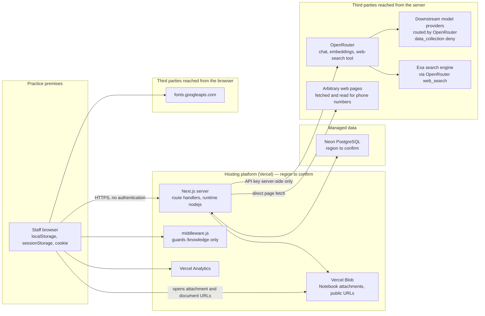

# Architecture — Riverside Helpdesk

**Purpose of this document.** A complete, factual description of what this system
is built from, where every piece of data goes, who processes it and where it is
stored. It is written to be the technical basis for the practice's **Data
Protection Impact Assessment** (`lib/dpia.js`, rendered at `/dpia`), so it
favours completeness over brevity and states what is *not* known as plainly as
what is.

Everything below was read from the code in this repository. Where a fact cannot
be established from the repository alone (hosting account settings, database
region, repository visibility), it is marked **[to confirm]** rather than
guessed.

- Repository: `https://github.com/F12-Syntex/Riverside-Helpdesk`
- Application name: Riverside Helpdesk (package `riverside-emis-helper`)
- Controller: The Riverside Practice (a UK NHS GP surgery)
- Users: practice staff only (reception, admin, clinical staff)
- Document status: current as of commit `9b8d6b4`, package version `6.4.0`

---

## 1. What the system is

An internal web application for practice staff. It is **not** patient-facing and
is not part of the clinical record. It sits alongside EMIS Web and AccurX; it
reads nothing from either and writes nothing back to either. Everything it knows
comes from documents and notes the practice has put into it.

It provides:

| Tool | Route | What it does |
| --- | --- | --- |
| Practice Q&A | `/` (also `/helpbot`) | Answers "how do we do X here?" from the practice's own documents and Notebook, with a verbatim quote behind every claim. The front door of the app. |
| Instant lookup | `/lookup` | Finds a telephone number — practice directory, then the CQC register of every registered service in England, then reads web pages for the number. |
| Signpost an AccurX request | `/signpost` | Reception pastes a patient's online-consultation text; returns who should pick it up and how urgently. **Care navigation only.** |
| Reason for appointment | `/reason` | Rewrites a patient's own words into clinical shorthand for the clinician. Also available in the assistant as the `/accurx` command, which puts that line, and the booking notes reception needs, on the same card as where the patient goes. |
| Code a document | `/coding` | Turns a pasted medical document (or a screenshot of one) into a one-line filing title. Also available in the assistant as the **Coding** mode (the `/coding` command), which is the one mode the patient-data screen does not run on. |
| Notebook | `/notebook` | The practice's own written procedures, in sections and pages, with file attachments. Read live by the assistant. |
| Medication check | `/medications` | General UK medicines information from public sources, cached. |
| Staff rota | `/rota` | Builds and balances a week's rota from staff records. |
| Settings | `/settings` | Which AI model each role runs on, and measured cost per question. |
| Activity audit log | `/stats` | What was done in the app, grouped by machine. Not linked from the menu. |
| Knowledge admin | `/knowledge` | Canonical-knowledge editor. Localhost-only; 404 everywhere else. |
| DPIA | `/dpia` | The practice's data protection impact assessment, rendered from `lib/dpia.js`. |
| Tools index | `/tools` | The short list of tools staff reach for. Lists the Q&A and Instant lookup only. |
| System map / index | `/diagram`, `/index` | Documentation pages. The system map is drawn in `app/_components/SystemMap.jsx`. |

Only the Q&A and Instant lookup appear on the tool index at `/tools`. Everything
else — the Notebook, the reception helpers, the medication check, the rota, the
system map and the audit log — is served and reachable by address, and is listed
at `/index`. `lib/dpia.js` records them all as live processing on that basis.

---

## 2. Technology stack

### Application

| Layer | Choice | Version | Notes |
| --- | --- | --- | --- |
| Framework | Next.js (App Router) | `^14.2.35` | Server components + route handlers in one deployment. |
| UI | React / React DOM | `18.3.1` | Client components; no CSS framework, plain CSS in `app/globals.css`. |
| Language | JavaScript (ESM) | — | No TypeScript. `jsconfig.json` maps `@/` to the project root. |
| Server runtime | Node.js | — | Every API route declares `export const runtime = 'nodejs'` and `dynamic = 'force-dynamic'`. Nothing runs on the Edge runtime except `middleware.js`. |
| Rich-text editor | TipTap (`@tiptap/*`) | `^2.27.2` | Notebook editing, plus `tiptap-markdown`. |
| Validation | Zod | `^3.25.76` | Agent tool input schemas. |
| AI orchestration | Vercel AI SDK (`ai`) | `^7.0.37` | Tool-calling loop for the agent. |
| AI provider client | `@openrouter/ai-sdk-provider` | `^3.0.0` | Plus direct `fetch` to the OpenRouter REST API in several routes. |
| Database driver | `@neondatabase/serverless` | `^1.1.0` | HTTP driver — one `fetch` per query, no connection pool held open. |
| File storage client | `@vercel/blob` | `^2.5.0` | Notebook attachments. |
| Analytics | `@vercel/analytics` | `^2.0.1` | Mounted globally in `app/layout.js`. |
| Document parsing | `mammoth` (DOCX), `pdfjs-dist` (PDF), `word-extractor` (legacy `.doc`), `jszip` (PPTX/RTF helpers), `@napi-rs/canvas` (PDF page rendering) | — | Offline ingest only; `pdfjs-dist` also runs in-browser for the document viewer. |
| Tests | `node --test` | — | Pure functions over fixtures, no database and no API key, which is why the whole suite runs in under a second. Gated on every push by `.github/workflows/app.yml`. |

### Data layer

| Store | Product | What it holds |
| --- | --- | --- |
| Relational database | **Neon** serverless PostgreSQL | All application state — see §7 for the full table inventory. Extensions used: `vector` (pgvector, 1536-dim, HNSW cosine indexes) and `pg_trgm`. |
| Object storage | **Vercel Blob** | Notebook file attachments. |
| Browser storage | `localStorage`, `sessionStorage`, one cookie | Chat history, custom guides, machine/session identifiers. |
| Repository files | Git | Practice source documents, parsed artefacts, the CQC extract, the practice contact directory, the e-RS referral-types CSV. |

### Hosting

Vercel is the deployment target. This is inferred from `@vercel/blob`,
`@vercel/analytics`, `@vercel/functions` (`waitUntil`, used in
`lib/knowledge.js`), the `process.env.VERCEL` check, `BLOB_READ_WRITE_TOKEN`,
and route-level `maxDuration` declarations (up to 300s). There is no
`vercel.json` in the repository and no other deployment manifest, so the actual
project, region and environment settings are **[to confirm]** from the hosting
account.

---

## 3. Trust boundaries and request topology



**Key boundary facts**

- The OpenRouter API key is read from `process.env.OPENROUTER_API_KEY` inside
  route handlers only. It is never sent to the browser.
- The database connection string is likewise server-side only.
- The browser talks to the application's own API and to three external hosts
  directly: Vercel Analytics, Google Fonts, and Vercel Blob (when a staff member
  opens an attachment).
- Practice source documents are *also* served as static files from
  `public/assets/rag/` — see §6.

---

## 4. Authentication and access control

**There is no authentication anywhere in the application.** No login page, no
password, no session, no SSO, no API token, no IP allow-list. A search of the
codebase finds no auth library and no auth middleware. Anyone who can reach the
deployment URL can:

- ask the assistant questions and read every answer it produces,
- read, edit and delete every Notebook page and attachment (`/api/notebook`),
- read and write staff records and rotas (`/api/staff`, `/api/rota`),
- change which AI model the practice runs on (`PUT /api/settings`),
- read the entire activity audit log, including every question ever asked
  (`GET /api/audit`, rendered at `/stats`),
- download a full Notebook backup (`GET /api/notebook/export`) and restore an
  arbitrary one (`POST /api/notebook/import`),
- read, take, download and delete the Notebook's saves, and **replace the whole
  Notebook** with any one of them (`/api/notebook/snapshots`,
  `/api/notebook/snapshots/load`, `/api/notebook/snapshots/import`),
- open any practice document served from `public/assets/rag/`.

The **only** access control in the codebase is `middleware.js` +
`lib/knowledge-admin-access.js`, which returns 404 for `/knowledge` and
`/api/knowledge/**` unless `NODE_ENV === 'development'` **and** the `Host` (and
`X-Forwarded-Host`, if present) is a loopback address. That protects the
knowledge-base admin screen and nothing else.

Two soft measures exist that are **not** access control and should not be
recorded as such in the DPIA:

- `/stats` and `/knowledge` are omitted from the landing page and the menu
  (`hidden` / `local` flags in `lib/routes.js`). The routes still answer.
- `npm run dev` binds to `127.0.0.1`. That applies to local development only.

Whether the deployment is protected at the platform layer (Vercel deployment
protection, password protection, a private network, or an unpublished URL) is
**[to confirm]** from the hosting account. Nothing in the repository provides it.

---

## 5. External services and data recipients

Every third party the system sends data to, and what reaches each one.

| Recipient | Reached from | What is sent | Controls in code |
| --- | --- | --- | --- |
| **OpenRouter** (`openrouter.ai/api/v1`) | Server | Staff questions; extracts of practice documents and Notebook pages; whole Notebook pages when opened; pasted AccurX consultation text (`/signpost`, `/reason`); pasted document text and screenshots (`/coding`); medicine names and questions; note text for AI formatting/organising; passage text for claim extraction; **all text embedded for search** — contact passages, practice-document passages, the router's trigger phrases, and, when the router is switched on, **the staff question itself on every turn** (`lib/routing/router.mjs` embeds it for the vector arm). Attached images are sent as base64 data URLs. | Every call sets `provider: { data_collection: 'deny' }`. Embedding calls additionally pin `provider: { order: ['azure'], allow_fallbacks: false, data_collection: 'deny' }`. `HTTP-Referer: https://riverside-practice.local` and `X-Title` headers are sent for attribution. |
| **Downstream model providers** | Via OpenRouter | Whatever OpenRouter forwards. Which company actually receives a prompt depends on which model is selected at `/settings` and on OpenRouter's routing. | `data_collection: 'deny'` restricts routing to providers that do not retain or train on prompts. The *geographic location* of those providers is not constrained by any code here — **[to confirm]**, and material for the international-transfer section of the DPIA. |
| **Exa** (search engine) | Via OpenRouter's `openrouter:web_search` server tool | The **web search query text**, which the model composes from the staff question. `lib/agent/web-search.mjs` requests `engine: 'exa'`. The same server tool is used by `/api/medication`. | Query only; no practice documents. But the query is model-generated from the question, so a poorly-worded question could carry content into it. |
| **Arbitrary web hosts** | Server (`lib/lookup/web-contact.mjs`, `contact-extract.mjs`) | An HTTP GET for the page. The server's IP is exposed to the site owner. No practice data is sent in the body. | Pages are fetched to extract `tel:`/`mailto:` links and visible numbers verbatim. |
| **Neon** (PostgreSQL) | Server | All stored application data (§7). | TLS (`sslmode=require` in the example connection string). Region is in the connection string, which lives in the git-ignored `.env.local` — **[to confirm]**. |
| **Vercel Blob** | Server (upload/delete) and browser (read) | Notebook file attachments, whatever they contain. | Uploaded with `access: 'public'` and `addRandomSuffix: true`. See §6. |
| **Vercel Analytics** | Browser | Page views and standard web-analytics signals from every staff device, including IP address, on every page (`<Analytics />` in `app/layout.js`). | None configured. Not mentioned in the current DPIA text. |
| **Google Fonts** (`fonts.googleapis.com`, and `fonts.gstatic.com` for the font files the stylesheet then references) | Browser | An HTTP request per page load to each: IP address, user agent, referrer. | None. `app/layout.js` preconnects to `fonts.googleapis.com` and links the Hanken Grotesk stylesheet. Self-hosting the font would remove both recipients entirely. |
| **GitHub Releases + the practice's shared drive** | Developer machines and staff PCs | The signed Chrome extension package (`.crx`) and `updates.xml`. No practice or patient data. | `.github/workflows/build.yml` signs with the `CRX_PRIVATE_KEY` repository secret and attaches the package to a GitHub release; a script on the practice network copies it to the shared drive, and Chrome only ever fetches from that drive (`extension/README.md`). **Release assets on a public repository are downloadable by anyone** — the same repository-visibility question as §5's GitHub row. |
| **GitHub** | Developer machines | The entire repository, **including `rag/sources/` — every practice policy and protocol document — and `lib/contacts.data.json`, the practice telephone directory.** | `.gitignore` excludes only `node_modules`, build output, `.env*.local` and logs. Repository visibility is **[to confirm]**; `gh` could not authenticate from this environment. If the repository is public, every committed practice document is public. |

---

## 6. Files served publicly

`public/` is served as static assets by Next.js with no access control.

- **`public/assets/rag/<doc-id>/…`** — a display copy of roughly 200 practice
  documents (HTML renditions of `.doc`/`.docx`, original PDFs, PPTX, extracted
  images). These are the practice's own policies: safeguarding, data protection,
  complaints, business continuity, records retention, DBS forms, registration
  forms, and so on. The assistant links to them so a citation can be opened
  in-browser. **Anyone who can reach the deployment can download all of them**,
  and the URLs are predictable slugs of the document titles.
- **`public/assets/dpia-template.docx`** — the ICO template.
- **`public/pdf.worker.min.mjs`** — the PDF.js worker for the in-app viewer.

`rag/sources/` (the raw originals) is deliberately outside `public/` and is not
served — but it is committed to git.

**Notebook attachments** are uploaded to Vercel Blob with `access: 'public'`.
The URL is the credential. `addRandomSuffix: true` makes it unguessable, but the
file is readable by anyone holding the link, indefinitely, and the link is stored
in plain text in `note_attachments` and returned by the API to any caller.

---

## 7. Data stores — full inventory

### 7.1 PostgreSQL (Neon)

All schema is created lazily by `ensure*Schema()` functions in `lib/db.js` using
`CREATE TABLE IF NOT EXISTS`. There are no migration files and no schema
versioning. Tables, grouped by the feature that owns them:

**Staff rota** — `ensureSchema()`

| Table | Columns | Personal data |
| --- | --- | --- |
| `staff` | `id, name, role, hours_per_week, notes, about, leave (jsonb), phone, temporary, created_at` | **Yes.** Named staff, mobile number, working hours, free-text notes, annual-leave dates. |
| `rotas` | `id, week_starting, notes, schedule (jsonb), created_at, updated_at` | **Yes, indirectly** — the schedule grid names staff and their shifts. |

**Notebook** — `ensureNotebookSchema()`

| Table | Columns | Personal data |
| --- | --- | --- |
| `notes` | `id, parent_id, title, body, position, is_section, created_at, updated_at` | **Free text written by staff.** Intended for procedures; nothing in the code prevents patient or staff details being typed in. This is risk #2 in the DPIA. |
| `note_attachments` | `id, note_id, url, pathname, filename, content_type, size, created_at` | Whatever is in the uploaded file. `url` is a public Blob URL. |
| `notebook_snapshots` | `id, label, kind, note_count, attachment_count, payload, created_at` | **A copy of every note's free text** at the moment the save was taken — the same exposure as `notes`, held for as long as the save is. |
| `note_revisions` | `id, note_id, title, body, reason, proposal_id, turn_id, created_at` | **A copy of a page's free text as it stood before a rewrite.** Written before every apply and every revert on the defragmentation path, so a change can be undone. Same exposure as `notes`. Cascades when the note is deleted. |
| `note_proposals` | `id, note_id, source_hash, body, map (jsonb), validation (jsonb), meaning (jsonb), status, turn_id, created_at, updated_at` | **A model-written rewrite of a page**, held server-side so the apply step trusts its own record rather than a flag from the browser. Same exposure as `notes`. |
| `note_defrag_runs` | `id, status, candidates (jsonb), cursor, stats (jsonb), turn_id, created_at, updated_at` | A whole-Notebook defragmentation run. `candidates` holds the contradictions found, which quote page text. |
| `note_defrag_items` | `id, run_id, note_id, title, path, status, proposal_id, detail, position, updated_at` | One page of one run. Titles and paths only. |
| `note_contradictions` | `id, run_id, pair_key, kind, verdict, severity, note_a, note_b, side_a (jsonb), side_b (jsonb), subject, why, reason, question, status, resolution, decided_at, created_at` | **Quotes both sides of a disagreement between two pages**, so it carries page text. `pair_key` lets a decision survive into the next run. |

**Canonical knowledge** — `ensureKnowledgeSchema()`

| Table | Purpose | Notes |
| --- | --- | --- |
| `knowledge_entries` | One row per document / Notebook page / contact: `kind ('document' \| 'note' \| 'contact'), title, content, data (jsonb), source_ref, authority, status, content_hash, claims_stale`. | Holds the **full text** of every practice document and every Notebook page. |
| `knowledge_passages` | Chunked passages: `heading, content, content_hash, embedding vector(1536), location (jsonb), search_doc tsvector` (generated, GIN-indexed). | **Contact and document passages are embedded; Notebook pages are not.** `fillMissingKnowledgeEmbeddings` returns early only for `kind === 'note'`, because a Notebook page is supplied to the prompt whole. Documents are embedded as they are synced (changed in `a46bb33`) so a document added since the last `rag:ingest` does not silently drop out of the semantic arm of `/practice`. Embedding means the passage text is sent to OpenRouter's embeddings endpoint. |
| `knowledge_claims` | Atomic claims extracted from passages: `subject, predicate, value, normalized_key, quote, fingerprint, confidence`. | Extracted by a model (`lib/ai/claims.js`, fast role) from passage text. |
| `knowledge_conflicts`, `knowledge_conflict_decisions` | Detected contradictions between claims, and the decisions taken on them. | — |
| `knowledge_claim_cache` | `content_hash → claims (jsonb)`. | Avoids re-sending unchanged text to the model. |
| `knowledge_sync_state` | `source_key → fingerprint`. | Lets a cold instance prove the bundle is current without reparsing. |
| `knowledge_analysis_jobs` | Coalescing queue for claim analysis, with lease/lock columns. | — |

**Question log** — `ensureQuestionLogSchema()`

| Table | Columns | Personal data |
| --- | --- | --- |
| `question_log` | `turn_id, machine_id, question, outcome, template, source, answer, model, duration_ms, images, attachments, error, provenance (jsonb), dismissed (jsonb), at` | **Stores the staff question verbatim and the answer as text.** `provenance` additionally holds the message split into its separate requests — each with the acuity code gave it and, where a span was quoted, **the patient's own words** — plus every deterministic rule that fired with the text that matched it, and the revision of each Notebook page the card stood in for. `dismissed` records which panel items reception closed, when, and from which machine. Written by `/api/agent` as each answer goes out; `provenance` and `dismissed` are added by `ALTER TABLE … ADD COLUMN IF NOT EXISTS`, so an existing install picks them up on the next schema check. |

**Routing** — `ensureRoutingSchema()`

| Table | Columns | Personal data |
| --- | --- | --- |
| `routing_triggers` | `id, target_kind ('note'), target_ref (the page's docId), phrase, phrase_norm, source ('generated' \| 'tap'), source_hash, embedding vector(1536), search_doc tsvector, created_at` | A `tap` row is a staff question as typed (≤400 chars), kept as the wording that meant that page. Same terms as `question_log`; the identifier redaction has already run on it. |
| `routing_decisions` | `turn_id, decision ('hit' \| 'ambiguous' \| 'miss'), confidence, margin, target_kind, target_ref, at` | None — numbers and a page id per routed turn, for the fall-through rate. |

**Model usage / cost** — `ensureUsageSchema()`

| Table | Columns | Personal data |
| --- | --- | --- |
| `ai_usage` | `turn_id, role, phase, model, input_tokens, output_tokens, at` | **None.** No question text, no machine id, no user. `turn_id` is random per turn and is not stored beside the question. |

**Answer feedback** — `ensureFeedbackSchema()`

| Table | Columns | Personal data |
| --- | --- | --- |
| `answer_feedback` | `id, machine_id, question, verdict, template, answer_kind, turn_id, at` | **Stores the staff question whole** (capped at 2,000 characters, *not* truncated to 400 the way the audit log is) beside the device identifier, whenever somebody presses a verdict button on an answer. A row exists only when a button was pressed, so this is a list of judged answers rather than traffic. Read back at `/feedback`. Written best-effort: a failed write is logged on the server and reported to the browser as accepted. |

**Activity audit log** — `ensureAuditSchema()`

| Table | Columns | Personal data |
| --- | --- | --- |
| `audit_machines` | `id (random 'm-' + 24 hex, minted in the browser), name, label, os, browser, device, screen, timezone, language, user_agent, first_seen, last_seen, events` | Device-level identifiers. **No IP address is stored** — deliberately, see `lib/audit/machine.js`. A machine can be named by hand ("Reception PC 1"), which may identify a person by desk. |
| `audit_events` | `machine_id, session_id, kind ('pageview' \| 'query' \| 'action' \| 'load' \| 'error'), tool, path, label, detail, method, status, duration_ms, at` | **`detail` holds staff question text verbatim** (truncated to 400 characters) for `/api/agent`, `/api/ask`, `/api/cqc`, `/api/lookup-web`, `/api/medication`. See the content rule below. |

**Referral routing** — `ensureSnomedSchema()`

| Table | Purpose |
| --- | --- |
| `snomed_terms` | SNOMED CT description snapshot: `concept_id, term, term_norm, semantic_tag, is_fsn`. Trigram-indexed. Reference data, no personal data. |
| `ers_directory` | The closed list of 406 e-RS Specialty + Clinic Type pairings from the practice's referral-types export. Reference data. |

**Medication cache** — `ensureMedicationSchema()`

| Table | Purpose |
| --- | --- |
| `medications` | `slug, name, data (jsonb), queries (jsonb), retrieved_at, updated_at`. Public medicines information plus the staff questions asked about each medicine (capped at 50, oldest evicted). |
| `medication_aliases` | Learned misspellings → canonical slug. |

**Runtime settings** — `ensureSettingsSchema()`

| Table | Purpose |
| --- | --- |
| `app_settings` | `key, value, updated_at`. One row per setting. The model roles: `ai_model` (reasoning), `ai_model_fast`, `ai_model_web`, `ai_model_accurx`, `ai_model_super_speed`, `ai_model_images`. The router: `routing_enabled` (**defaults to off**), `routing_hit_cos` (0.82), `routing_ask_cos` (0.70), `routing_min_margin` (0.15) — `lib/routing/thresholds.mjs`. No personal data; anyone who can reach `PUT /api/settings` can change all of them. |

#### The audit content rule

`lib/audit/describe.js` defines `CONTENT_NEVER_RECORDED`:

```
/api/signpost   /api/reason   /api/docfile
/api/medication/extract
/api/notebook/format   /api/notebook/organize   /api/notebook/import
/api/notebook/snapshots/import
/api/knowledge
```

For these routes the audit log records **that** the tool was used and **how many
characters** were pasted — never the text. The guard is structural, not
advisory: `describeRequest()` passes `body: null` to the describer for a guarded
path, so a describer physically cannot leak the content. These are exactly the
routes patient text is pasted into, which is what makes this the rule that
matters most for the DPIA.

Everything else — the assistant question, a directory search, a medicine name —
is recorded in full (truncated to 400 characters), on the basis that it is the
staff member's own words about practice business.

### 7.2 Browser storage

| Key | Store | Lifetime | Contents |
| --- | --- | --- | --- |
| `riva.machine.id` | `localStorage` | Until cleared | Random machine identifier, `m-` + 24 hex. |
| `riva_machine` | Cookie, `Max-Age` 1 year, `Path=/`, `SameSite=Lax` | 1 year | Mirror of the same identifier, so clearing one store does not split a machine's history. |
| `riva.machine.session` | `sessionStorage` | Tab lifetime | Random visit identifier, `s-` + 16 hex. |
| Chat history and custom guides | `localStorage` (`app/page.js`) | Until cleared | **Whatever staff typed, including anything pasted into the chat.** This never leaves the browser except as part of the `history` string sent with the next question. |

The machine identifier is random and locally minted. It is not derived from the
device and carries no information about who is using it; but it is a persistent
device identifier, and combined with a hand-typed machine name it can identify
an individual by workstation.

### 7.3 Files in the repository

| Path | Contents |
| --- | --- |
| `rag/sources/` | ~200 original practice documents (`.doc`, `.docx`, `.pdf`, `.rtf`, `.pptx`). Policies, protocols, forms, registration and DBS forms. |
| `rag/processed/` | `catalog.json`, `chunks.jsonl.gz`, `embeddings.json`, `manifest.json` — the parsed and embedded artefacts. |
| `public/assets/rag/` | Public display copies of the above (see §6). |
| `lib/contacts.data.json` | The practice's own telephone directory — names, numbers, emails. |
| `lib/lookup/cqc.data.json.gz` | The CQC register extract, ~57k registered services. Public data. |
| `lib/lookup/hospitals.data.json` | Hospital reference data. |
| `ereferrals.csv` | The e-RS referral-types export (406 Specialty/Clinic Type pairings). |
| `lib/referrals/nel-tree.data.json` | Primary Care IT's NEL Referral Tree: 533 referral form names, each with its clinical category and which of the five North East London areas can see it (247 for City & Hackney). Generated from the published support article by `npm run data:nel-tree`; reference data, no patient content. |
| `lib/referrals/nel-contracts.data.json` | Primary Care IT's NEL PCCIF contract mobilisation position: 42 contract specifications mapped to the EMIS Web templates that implement them, with the build status each had **as at 28 July 2026**. Generated by `npm run data:nel-contracts`. A dated snapshot, not a live feed — every answer built from it leads with that date. Reference data, no patient content. |
| `.env.local` | Secrets. Git-ignored (`.env*.local`). |

---

## 8. How a question is answered — the main data flow

`POST /api/agent` (`app/api/agent/route.js`). **One model call, not a research
loop.** Streams newline-delimited JSON to the browser (`status`, `tool-start`,
`tool-result`, `answer`, `error`) so the field sees which step is running.

```mermaid
sequenceDiagram
  participant B as Browser
  participant A as /api/agent
  participant PG as Postgres
  participant OR as OpenRouter
  B->>A: question, history, images, attachments, template (a slash command)
  A->>A: identifier redaction, then the safety scan of the whole message — no model
  A->>A: practice directory match — no model
  alt the directory answers it
    A-->>B: contacts card
  else
    A->>PG: load EVERY non-empty Notebook page in full
    A->>PG: ROUTE — the trigger index: exact, lexical, vector, fused (lib/routing; off by default)
    Note over A,PG: a confident, clear match renders that page with no model call;<br/>a close call asks back; anything else falls through to SELECT unchanged
    A->>OR: SELECT — fast role, one generateObject call:<br/>a template (or a Notebook page title) and its variables
    opt the page's folder is tagged with an output shape
      A->>OR: FORMAT — one focused read of that page
    end
    A->>A: RENDER the template in code (lib/templates)
    alt no template fits
      A->>OR: PROSE — fast role, the whole Notebook as system prompt
      A->>A: redact any number the Notebook, question or attachment does not contain
    end
    A-->>B: answer payload — or a question back with options
  end
  A->>PG: question_log row, ai_usage rows (after the answer has gone out)
```

**Phase detail**

0. **Identifier redaction** — before anything else, and with no model in its
   path: names and addresses are stripped out of the question
   (`lib/safety/identifiers.mjs`). The browser did this already as the message
   was sent, so in the ordinary case nothing changes here; the endpoint repeats
   it so a request made any other way is held to the same rule. The one
   exception is document coding, whose input *is* a letter about a patient
   (`checksPatientData`, `lib/commands.mjs`).
1. **Safety scan** — deterministic and message-wide, before any model runs
   (`lib/safety/scan.mjs`): red flags, NICE NG12 suspected-cancer features,
   safeguarding, and the acuity band the message belongs to. The findings become
   the bands above whatever card is rendered, on every path below including a
   failed turn.
2. **The directory is asked before the model is** — a message asking for a
   contact detail that the practice directory holds is answered from it
   verbatim (`lib/templates/directory.mjs`): no model, no tokens.
3. **A slash command skips the choosing** — `/accurx`, `/coding`, `/practice`,
   `/form`, `/template` name the template outright (`lib/commands.mjs`), so the
   model is asked for that one template's values and nothing else. `/practice`
   is the only path that retrieves: a hybrid lexical + vector search over the
   practice documents (`searchKnowledge`, `lib/knowledge.js`), answered in prose
   with each part quote-checked against the passage it cites
   (`lib/agent/practice-answer.mjs`); a part whose quote is not found is dropped.
4. **Notebook load** — `fullNotebookContext()` reads *every* non-empty Notebook
   page from the live tables, in full. Nothing is chunked, truncated or selected
   by similarity; the block goes first in the prompt so a provider that caches
   prefixes pays for it once. A Notebook that has outgrown
   `NOTEBOOK_FULL_MAX_CHARS` falls back to a title catalogue.
5. **Routing** — in front of the picker, and **off by default**
   (`lib/routing/`, switch and thresholds at `/settings`). Each Notebook page
   carries trigger phrases — how reception staff would ask for it, generated
   once by the fast role (`npm run routing:seed`) and learned from clarify
   taps. The question is normalised and matched exactly, then by tsvector and
   by embedding over those phrases, fused by reciprocal rank (the same `1/(60 +
   rank)` as `searchKnowledge`). The decision reads two numbers the picker
   never had: the cosine similarity of the best phrase (confidence) and how far
   ahead of the runner-up page it is, in the same cosine units (margin). The
   fusion orders the candidates — that is what lets a rare token like 2WW
   outrank a paraphrase — but it never sets the margin: a gap between fused
   scores is about 0.016 for any runner-up one rank behind, whatever the two
   pages say. Confident and clear → the page is rendered
   with **no model call**; confident but close → a question back with the
   pages as options, and a tap teaches the router (`POST /api/routing/learn`);
   anything else → the picker, with its inputs untouched. A wrong page
   rendered confidently is the failure to watch: it is the headline metric of
   `evals/routing/bench-pages.mjs`, and the reason the hit threshold starts
   conservative.
6. **Selection** — one `generateObject` call on the **fast role** (the images
   role when a picture is attached), `temperature: 0`, output capped at
   `READ_MAX_TOKENS`, against `SELECTION_SCHEMA` (`lib/templates/route.mjs`).
   The model returns which template fits — a closed enum, or a Notebook page
   title — and that template's variables. It does not write the answer. A
   message that looks multi-intent is also asked where each separate ask starts
   and ends, and code decides everything after that (acuity is a table, not the
   model's opinion). A provider that refuses structured output is asked again as
   plain text and the first JSON object in the reply is parsed and re-validated.
7. **Render** — the template is filled in code (`lib/templates/`). A Notebook
   page is rendered from the database exactly as the practice wrote it. Where the
   page's folder carries an output tag (Notebook sidebar → *Format answers as*),
   one more focused read lifts that tag's values from the page and draws them
   above it; the page is still shown underneath, so a thin read costs nothing.
8. **Asking back** — when the message reads two ways and the two ways go
   different places, the turn ends in a question with the readings as options;
   tapping one asks the original question again with the ambiguity settled.
9. **Prose fallback** — only when no template fits. The fast role writes an
   answer with the whole Notebook as its system prompt; the card is marked as
   the assistant's own work (`general: true`), and any digit run that does not
   appear in the Notebook, the question or an attachment is redacted
   (`redactUnverifiedNumbers`).
10. **Log** — after the answer has been sent: one `question_log` row (the
   question, the answer as text, the template that built it, the model that
   ran) and one `ai_usage` row per model call.

**What is not here.** There is no research tool loop, no evidence registry, no
compose/validate/repair cycle and no answer cache. Those were the previous
generation of this endpoint; `ANSWER-PIPELINE-REDESIGN.md` records how it worked
and why it was replaced.

### Contacts

A contact question is answered from structured data, never through the model's
prose: the practice directory first (`lib/contacts.data.json`, matched in
`lib/contacts.fuzzy.mjs`), then the CQC register at `/lookup`, then — for
Instant Lookup only — the open web, where the page is *fetched and read* and
`tel:`/`mailto:` links and visible numbers are lifted verbatim. **No digit on
any of these paths is written by a model.**

### Referral routing

Where the Notebook records a Specialty and Clinic Type, the Notebook wins. Where
it does not, `lib/referrals/` matches the condition to a SNOMED concept and then
scores that concept's wording against the closed list of 406 e-RS pairings. There
is no published SNOMED-to-e-RS mapping, so the join is textual and everything it
returns is labelled a suggestion to check against the doctor's task.

**The card is narrow on purpose.** `scope.mjs` decides whether there is an e-RS
form behind the question at all, and the same rule gates every stage: whether
the lookup runs at all, and whether a pairing is filled in after the answer is
rendered. A question is only a referral request when somebody is *making* one —
not a referral arriving from a hospital or from 111, not one already sent that is
being chased or cancelled, not a waiting time, and not a policy that merely uses
the word. A pairing the practice never wrote down needs a match confident enough
to act on; without that, no card. A pairing the practice *did* record is shown
unless the answer routes the reader somewhere else (email, Accurx).

---

## 9. The other data flows

| Flow | Endpoint | What leaves the practice | Stored |
| --- | --- | --- | --- |
| Patient-data screen | `POST /api/screen` | The typed message, ≤4,000 chars, **after the same name-and-address redaction the send itself applies** — so the screen never sees more than `/api/agent` was already about to. Runs on the **Super speed** role before the message is sent. **Not on the Coding mode** (`checked: false` in `lib/commands.mjs`): a discharge summary identifies a patient by definition, so screening it would refuse the one thing that mode is for — the same reason an attached document is not screened either. **The name-and-address redaction does not run on it either**, in the browser or at `/api/agent`: one flag answers for both guards, so a letter pasted into that mode reaches the model as it was pasted. Like the standalone reception helpers, that paste carries the duty to remove identifiers first. | **Nothing.** No question log row, no audit entry, no cache — a screened message is not a turn, and a check that recorded every message somebody thought better of would be a worse record than the one it protects. Token counts only, in `ai_usage`. |
| Signposting | `POST /api/signpost` | The pasted AccurX consultation text (≤20,000 chars) plus the practice's destinations (`lib/triage/destinations.mjs`), to OpenRouter. | **Nothing.** Not cached. Audit records the size only. |
| Reason for appointment | `POST /api/reason` | The pasted consultation text (≤20,000 chars) to OpenRouter. | **Nothing.** Audit records the size only. |
| Document coding | `POST /api/docfile` (and the `/coding` command on `/api/agent`) | Pasted document text or a screenshot, plus the "Document coding" Notebook section. | **Nothing.** Audit records the size only. |
| Medication check | `POST /api/medication` | Medicine name + optional question, to OpenRouter with the `openrouter:web_search` server tool (Exa). | The result is cached in `medications`; the question text is stored in the `queries` jsonb. |
| Medicine extraction | `POST /api/medication/extract` | A pasted list or prescription snippet. | Nothing. Audit records the size only. |
| Notebook format / organise | `POST /api/notebook/format`, `/organize` | The note's text, to OpenRouter. Returned as a diff/plan the user must confirm — nothing is saved unseen. | The confirmed result is saved as note text. Audit records the action only. |
| Notebook edit | `PATCH /api/notebook` | Nothing to OpenRouter at save time (`upsertKnowledgeEntry(..., { embed: false })`), but the text is queued for **claim extraction**, which does send it to the fast-role model. | `notes`, `knowledge_entries`, `knowledge_passages`, `knowledge_claims`. |
| Notebook backup | `GET /api/notebook/export` | — | Downloads every note and attachment record as one JSON file, to any caller. |
| Notebook saves | `/api/notebook/snapshots` (+ `/load`, `/import`) | — | A save is every note and attachment record, kept in `notebook_snapshots` and downloadable as the same JSON file, to any caller. Loading one replaces the Notebook; the state it discards is saved first. |
| Instant lookup (register) | `GET /api/cqc` | Nothing external — the gzipped extract is searched on the server. | Query text recorded in the audit log. |
| Instant lookup (web) | `GET /api/lookup-web` | The search query to OpenRouter/Exa; then direct GETs to the pages found. | Query text recorded in the audit log. |
| Rota | `/api/rota`, `/api/staff` | Staff names and constraints go to the model when a rota is generated from plain-English rules. | `staff`, `rotas`. |
| Settings | `GET/PUT /api/settings`, `GET /api/settings/models` | A catalogue fetch to OpenRouter (no practice data). | `app_settings`. |
| Audit | `POST/GET/PATCH /api/audit` | Nothing external. | `audit_machines`, `audit_events`. |
| Close an unresolved item | `POST /api/questions/dismiss` | Nothing external. | Appends to `question_log.dismissed` on the turn the panel was shown for. Best-effort: nothing in the app waits on it. |
| Knowledge admin | `/api/knowledge/**` | Passage text to the fast-role model for claim extraction. | The knowledge tables. Localhost-only. |
| Read a dropped file | `POST /api/attach` | **Nothing external.** The bytes are parsed to text in the function (`mammoth`, `pdfjs-dist`, `word-extractor`, `jszip`) and returned to the browser that dropped them. | **Nothing.** Not written to disk, not stored in the database, not embedded. The text lives in the browser until the question it came with is asked, and is then sent to OpenRouter as context with that question. Images never take this path — the model looks at those directly. |
| Verdict on an answer | `POST /api/feedback`, `GET /api/feedback` | Nothing external. | `answer_feedback` — the question whole (≤2,000 chars) beside the machine id. Read back at `/feedback`. |
| Read the question log | `GET /api/questions` | Nothing external. | Reads `question_log`. Rendered at `/stats`. |
| Teach the router | `POST /api/routing/learn` | **The staff question to OpenRouter's embeddings endpoint**, to vectorise it as a trigger phrase. | `routing_triggers` — the question as typed (≤400 chars, already identifier-redacted) with `source = 'tap'`, plus its embedding. This is a second store of question text, separate from `question_log`, and the machine-level logging opt-out does **not** cover it. |
| Router, on every turn (when switched on) | inside `POST /api/agent` | **The staff question to OpenRouter's embeddings endpoint** for the vector arm, on any question over 8 normalised characters. | `routing_decisions` — the decision, confidence, margin and page id per routed turn. No text. |
| Defragment the Notebook | `GET/POST /api/notebook/defrag`, `/defrag/run` | **Notebook page text to OpenRouter** — to propose rewrites and to find contradictions between pages. | `note_defrag_runs`, `note_defrag_items`, `note_contradictions`, `note_proposals`, and `note_revisions` before every apply. |
| Undo a page rewrite | `POST/GET /api/notebook/revert` | Nothing external. | Restores from `note_revisions`, writing a further revision first. |
| Notebook map | `GET /api/notebook/map` | Nothing external. | Reads the notes; renders the treemap at `/notebook`. |
| Knowledge bootstrap | `GET /api/directory`, `GET /api/kb` | Nothing external at request time. | Reads the committed bundle (`rag/processed`, `rag/context`) from disk and reconciles it into the knowledge tables. |
| Model catalogue | `GET /api/settings/models` | A catalogue fetch to `openrouter.ai/api/v1/models`. No practice data. | Nothing. |

---

## 10. AI configuration

### Model roles

The model is **not** an environment variable. It lives in `app_settings` and is
changed at `/settings`, so it can be changed without a redeploy.

| Role | Setting key | Job | Fallback chain |
| --- | --- | --- | --- |
| **reasoning** | `ai_model` | Researches the question **and writes every answer**. | `DEFAULT_AI_MODEL = google/gemini-3.5-flash-lite` |
| **fast** | `ai_model_fast` | Short background jobs nobody reads: claim extraction, summarising, query condensing. | `OPENROUTER_ANALYSIS_MODEL` → reasoning |
| **web** | `ai_model_web` | Searching the internet, and reading a page for a number. | `OPENROUTER_WEB_MODEL` → `OPENROUTER_MEDICATION_MODEL` → `OPENROUTER_ANALYSIS_MODEL` → reasoning |
| **accurx** | `ai_model_accurx` | Reading a pasted `/accurx` request against the practice's own destinations (`lib/triage/destinations.mjs`) and its Notebook: one call, which names where it goes, writes the reason line and booking notes, and says whether the message reports somebody having already dealt with it. | `OPENROUTER_ACCURX_MODEL` → **fast** |
| **superSpeed** | `ai_model_super_speed` | Checking a message for patient details **before it is sent**, and stopping it if there are any. One yes-or-no per message. | `OPENROUTER_SUPER_SPEED_MODEL` → **fast** |
| **images** | `ai_model_images` | Any message with a picture attached — a screenshot of the repeat-medication screen to format for AccurX, a photo of a letter — whichever path it takes: a command, the template picker, or prose. | `OPENROUTER_IMAGES_MODEL` → **its own default**, `DEFAULT_IMAGES_MODEL = mistralai/ministral-14b-2512` |

**The accurx and superSpeed roles inherit from *fast*, not from reasoning** —
the only two that do, and for opposite reasons. `accurx` falls back to fast so
that adding it changed nothing about what `/accurx` costs; the row exists so a
practice *can* put a better model on the one decision in the app that is a
judgement about a patient rather than reading or extraction. `superSpeed` does
it because the reasoning model is the **wrong** default for it: that role holds
the send while a message is screened, so an install that has chosen a large,
careful model above would otherwise have put that model in front of every
message anybody types. It is the only role a reader waits on with nothing on the
screen yet, and it should be set to the quickest thing on the list rather than
the cleverest.

**The images role is the only one that does not inherit at all.** There
used to be no vision role — whichever model was answering read pasted images —
which meant a practice that chose a text-only model above could not paste a
screenshot. A message carrying an image now runs on the images role on every
path through `/api/agent`, and an unset images role is a small
vision model of its own rather than "whatever is answering". The document
ingester still reads images with the reasoning model.

**Which role actually runs `/api/agent` — read this before quoting the table
above.** As of `9b8d6b4` the assistant endpoint resolves one model for the whole
turn and it is the **fast** role (`const model = roles.fast.model`,
`app/api/agent/route.js`), with the **images** role substituted for any message
carrying a picture. The reasoning role (`ai_model`) is what an unset fast role
falls back to, and it is still the model named on the settings page and used by
the document ingester — but on an install that has set a fast model, no part of
an assistant turn runs on the reasoning model. The paragraph below describes the
design intent of the previous pipeline and is retained because the DPIA's
supplier and cost sections were written against it; **the code is the fast
role**, and the intent and the code should be reconciled deliberately rather
than by reading one and assuming the other.

**Design intent, as previously recorded: the answer is always written by the
reasoning model.** That was architectural,
not a tunable: writing is the one job that needs the whole context held at once.
The cheaper roles exist to keep work *away* from that model, never to take the
writing off it.

### Provider routing and retention

**`lib/ai/openrouter.mjs` owns the shape of every OpenRouter request.** Nothing
else builds one: `chatRequest` / `chatBody` stamp the two required settings last,
after whatever the caller passed, so a call site cannot override them by
accident. `test/no-reasoning.test.mjs` walks `app/`, `lib/` and `rag/` and fails
the build if any file writes the completions URL, a `data_collection` key or a
`reasoning` object of its own.

- Every chat completion sets `provider: { data_collection: 'deny' }`, which
  restricts OpenRouter to providers contractually set not to retain or train on
  prompt data.
- Embeddings additionally pin `provider: { order: ['azure'],
  allow_fallbacks: false, data_collection: 'deny' }` — a single zero-retention
  provider with no fallback. (Embeddings are the one endpoint that does not go
  through `chatBody`; there is nothing to reason about.)
- **Extended reasoning is held to the minimum everywhere** (`reasoning: {
  effort: 'minimal', exclude: true }` — `NO_REASONING` in
  `lib/ai/openrouter.mjs`), not only on the agent. It asks for minimal effort
  rather than `enabled: false` because a growing number of endpoints — including
  the app's own default model — reject an explicit disable outright ("Reasoning
  is mandatory for this endpoint and cannot be disabled"), which failed every
  call carrying it. `exclude: true` keeps the reasoning tokens out of the
  response. Nothing this app asks a model to do
  is a puzzle: the thinking has already been done by the staff who wrote the
  Notebook, by the prompts, and by the code that checks each claim against its
  source afterwards. On a model that deliberates first, that wait is most of what
  a receptionist experiences, paid on every request. Models that always reason
  ignore the flag; the rest answer straight away.
- What is **not** constrained anywhere in the code: the geographic location of
  the provider that ends up serving a request. Written assurance from OpenRouter,
  and the residency question, are open items in the DPIA (steps 3 and 4).

### Cost measurement

Every phase of every turn writes a row to `ai_usage` — role, model, tokens in,
tokens out, no question text. `/settings` averages the last 30 days **per
question** (grouped by `turn_id`, so a repaired answer counts once) and **per
model**, so changing model shows nothing until the new model has been used, and
changing back restores the previous model's record untouched. Nothing is ever
reset or deleted.

---

## 11. Personal data — where it can appear

| Category | Where it can be | Intended? |
| --- | --- | --- |
| **Staff names, roles, hours, leave, mobile numbers** | `staff`, `rotas`, `lib/contacts.data.json`, practice documents in `rag/sources/` and `public/assets/rag/` | Yes |
| **Staff and third-party names inside practice documents** | `knowledge_entries.content`, `knowledge_passages.content`; sent to OpenRouter as answer context | Yes — DPIA risk #3 |
| **Patient data pasted into a question** | `audit_events.detail`, `question_log`; sent to OpenRouter | **No — DPIA risk #1, rated High.** The on-screen warning is the only control; automatic screening is listed as "to do". |
| **Patient data typed into a Notebook note** | `notes.body`, `knowledge_entries`, `knowledge_passages`, `knowledge_claims`, attachments in Blob; sent to OpenRouter for claim extraction | **No — DPIA risk #2, rated High.** |
| **Patient consultation text (AccurX)** | Transits `/signpost`, `/reason`, `/docfile` to OpenRouter. **Not stored anywhere**; the audit log records size only. | Yes, by design — the tools exist for it. The UI states identifiers should be removed first; nothing enforces it. |
| **Patient data inside a Notebook attachment** | Vercel Blob, at a **public URL** | No |
| **Device identifiers** | `audit_machines`, browser cookie + localStorage | Yes |
| **IP addresses** | **Not stored by the application.** Present in hosting-platform logs, Vercel Analytics, Google Fonts requests, and at any web host contacted for a phone number. | Platform-level |

No special-category or criminal-offence data is sought by any feature. Nothing
prevents it arriving in free text.

---

## 12. Retention and deletion

| Data | Retention | Deletion path |
| --- | --- | --- |
| `notes`, `note_attachments` | Until staff delete them | `DELETE /api/notebook` cascades the subtree, archives the knowledge entries, and deletes the Blob objects. |
| `notebook_snapshots` | Saves taken by staff: until deleted from `/notebook/saves`. Saves taken automatically before a load: the last ten, older ones pruned on the next load. | `DELETE /api/notebook/snapshots?id=`. Deleting a note does **not** remove it from saves taken before the deletion. |
| `knowledge_*` | Follows the source entry; an archived entry cascades its passages, claims and conflicts | Automatic on note delete / document removal |
| `ai_usage` | **Indefinite — never reset or deleted, by design** | None. Contains no personal data. |
| `audit_machines`, `audit_events` | **Indefinite. No retention policy, no purge job, no delete endpoint.** | None in code. Open item for the DPIA. |
| `medications`, `medication_aliases` | Indefinite; `queries` capped at 50 per medicine, oldest evicted | None |
| `staff`, `rotas` | Indefinite | `DELETE /api/staff`. The DPIA notes this data outlives the withdrawn tool — risk #6. |
| Browser chat history and guides | Until the staff member clears the browser | Client-side only |
| `riva_machine` cookie | 1 year, refreshed on use | Clearing browser data |
| `snomed_terms`, `ers_directory` | Reference data, replaced by re-running `npm run data:ers` | — |

---

## 13. Build, ingest and deploy

```
npm install
npm run dev            # copies the PDF worker, then next dev -H 127.0.0.1
npm run build && npm run start
npm test               # node --test over test/
npm run versions -- --check   # package.json against the commit history
```

**Every push is gated.** `.github/workflows/app.yml` runs those three on every
push to `main` and every pull request: the suite, the version check (the
version is bumped by hand in the commit that earns it, and this is the only
thing that notices when it was not), then the real build, which is what
catches an import of something that was deleted. It needs no secrets — every
page is a client component and no route is evaluated at build time, so neither
`DATABASE_URL` nor `OPENROUTER_API_KEY` is required to build.

`.github/workflows/build.yml` is separate and unrelated: it signs and publishes
the Chrome extension, and only when `extension/**` changed.

**Document ingestion** is an offline, developer-run pipeline — not something the
running application does:

```
npm run rag:status     # what is indexed / new / changed
npm run rag:ingest     # parse and embed new or changed files in rag/sources/
npm run rag:prune
```

Each source file is hashed, so re-running only touches what changed. Parsers live
in `rag/parsers/` (`.doc`, `.docx`, `.pdf`, `.pptx`, `.rtf`, text, images) and
all emit the same normalised chunk record. PDF pages are both text-extracted and
rendered to PNG; a page with no selectable text, and any image file, is read by
the **vision-capable chat model** rather than an OCR engine — which means
document images are sent to OpenRouter at ingest time. Output goes to
`rag/processed/` and display copies to `public/assets/rag/`, both committed.

`npm run data:cqc -- <csv>` rebuilds the CQC extract from a newer published
export; `npm run data:ers` loads the SNOMED snapshot and the e-RS referral-types
CSV into Postgres.

At runtime, `/api/knowledge/sync` idempotently reconciles the committed bundle,
the Notebook and the contacts into the canonical Postgres tables; a persisted
fingerprint means an unchanged bundle costs a fingerprint comparison rather than
a reparse.

**Environment variables** (`.env.local`, git-ignored; documented in
`.env.local.example`):

| Variable | Purpose |
| --- | --- |
| `OPENROUTER_API_KEY` | Server-side only. The single credential for chat, embeddings and web search. |
| `DATABASE_URL` | Neon pooled connection string. |
| `BLOB_READ_WRITE_TOKEN` | Vercel Blob. |
| `OPENROUTER_EMBED_MODEL` | Default `openai/text-embedding-3-small`. |
| `OPENROUTER_ANALYSIS_MODEL`, `OPENROUTER_RESEARCH_MODEL`, `OPENROUTER_WEB_MODEL`, `OPENROUTER_MEDICATION_MODEL` | Role fallbacks, overridden by `/settings`. |
| `SUPPLEMENTARY_CONTEXT_URLS`, `SUPPLEMENTARY_CONTEXT_TTL` | Optional extra context fetched from direct URLs at request time. |

`rag/lib/config.mjs` parses `.env.local` itself for standalone `node` scripts,
without overriding real environment variables.

---

## 14. Accuracy and safety controls

These matter to the DPIA's "wrong answer leads to an incorrect administrative
action" risk.

- **Grounding.** The model does not write a practice-backed answer: it names
  the template or Notebook page that fits, and the card is rendered in code
  from what the practice wrote. The one written answer over practice material
  (`/practice`) carries a verbatim quote per part, verified in code against the
  passage it cites; a part whose quote is not found is dropped rather than
  shown. The prose fallback is marked as the assistant's own work.
- **Provenance is explicit.** Practice-backed sections carry an openable
  citation. Web-derived content is marked "from the web" with a link and is never
  presented as practice policy. Gaps are stated plainly with who to ask, rather
  than filled from model knowledge.
- **Numbers are never authored by a model.** A rendered card carries only what
  the practice recorded; prose is checked against the directory, the Notebook,
  the question and any attachment, and every other digit run is redacted.
- **Referral pairings** determined from the e-RS list rather than the Notebook are
  labelled as such, with the concept, the list, the closeness of the match and the
  near alternatives shown, under a heading saying they must be checked against
  the doctor's task.
- **Scope.** Administrative help for staff only — never clinical or medical
  advice. Clinical questions are refused and possible emergencies escalated (999
  / alert a clinician). `/api/medication` carries a deterministic emergency
  backstop that fires **before** any model call and cannot be filtered away.
- **Nothing in a message is answered silently.** The selection call returns one
  template, so a message carrying several requests is split into its separate
  asks on the same call and every one of them is listed beside the answer,
  marked routed, flagged, refused or unhandled. What is *not* answered is
  visible rather than absent.
- **The safety scanners are code, not prompt instructions, and run message-wide
  on every turn** regardless of which template was chosen (`lib/safety/`): the
  red-flag list, cauda equina, and NICE NG12 suspected-cancer features. Each
  reports the words that fired it. Acuity is a fixed rank table
  (`emergency > twoWeekWait > sameDay > routine > admin`); no model ranks it.
- **A request about a third party's record is refused by a pattern rule** before
  anything is routed, with no model in its path.
- **Names and addresses are taken out of the question before it is sent**
  (`lib/safety/identifiers.mjs`). The check is local — regex, a forename list
  and a token scan, no model and no network — and runs in the browser as the
  message is sent, so an identifier it catches never leaves the machine it was
  typed on; `/api/agent` runs it again on arrival, so the guard
  belongs to the endpoint rather than to the page. What was removed is shown as
  a count, in a warning beside the question and in a toast; the identifier is
  never quoted back and never reaches the model, the question log or the audit
  log. It redacts rather than refusing to send, because making somebody retype
  a sentence in a hurry does not get the name out of the world. Clinician
  titles (`Dr`, `Nurse`, `Matron`) and names in the practice directory are left
  alone deliberately — a check that eats "which days is Dr Ahmed in" is a check
  that gets worked around. Attached documents are **not** redacted: they are
  the reader's own material, sent on purpose, and a filing title is often about
  the letter's own header.
- **A card may only assert what its own complaint's text supports.** Every
  feature carries the span that proved it, and a sentence whose evidence lies in
  another complaint is dropped rather than written — the failure mode that had a
  knee card claiming self-care had failed on the strength of a sentence about
  the patient's voice.
- **The one second model pass** (`/accurx` only) may raise acuity
  above what the scanners found and may never lower it; if it fails or times out
  the deterministic answer stands unchanged.
- **`/accurx` is decided by reading the message, against the routing guide and
  nothing else** (`lib/templates/accurx-route.mjs`). **One call**, on its own
  model role, returning where it goes, why, the wording, and every separate thing
  the message asked for. It used to be a fan-out of one closed question per
  destination beside a second call that wrote the reason line; the destinations
  are written down as data now (`lib/triage/destinations.mjs`), which is what
  lets one reader be handed the whole ladder and see what nine saw between them.
  - **The prompt IS the guide.** Every destination least-senior-first with its
    `covers` and — the half that decides most messages — its `refuses`; the
    practice's **hard gates**, which are absolute and not clinical judgements (no
    phlebotomy under 16, FCP adults only, HPV to 24 and under, six weeks for
    travel jabs, Health Checks from 40, health-check bloods before 1 pm, nurse
    clinics Mon/Wed/Fri); and the nurse rules and the bloods-first list. All of it
    is generated from the same array `docs/routing.md` is transcribed into, so the
    prompt cannot drift from the cards or from the signposting page.
  - **The Notebook is not in it.** It was, as a catalogue of page titles. The
    Notebook is how the practice *does* things and the guide is where a task
    *goes*; a title was all the reading ever saw of a page, so what it actually
    got was a list of headings to match against — the failure mode this path
    exists to replace. Removing it also took a database round-trip and roughly
    3,000 prompt tokens off the one call the receptionist waits for.
  - **There is no pattern floor here any more, and the prompt says so.** The
    cascade came off this path when it told reception to interrupt a doctor over
    a chest pain the same message said was investigated at A&E last winter and
    turned out to be reflux — an alarm the words had raised that nothing was
    allowed to retire. Nothing now catches what the reading misses and nothing
    retires what it raises, so it is given the guide's own front-page rule
    instead: **when you are not sure, route upward**; `dutyDoctor` is the right
    answer for anything that cannot be confidently placed. `applyRoute` still
    implements the never-lower fold and is still tested, but the only caller that
    passes it a floor is the ordinary router's own triage card.
  - **`unsure`, a timeout, no key, a refusal, an unknown destination** all land on
    the duty doctor — one rule in one place (`lib/templates/accurx.mjs`) rather
    than a special case per failure.
  - The words that decided it are the patient's own, verbatim, checked with
    `spanWithin` before they are rendered; a destination whose quote does not
    check out still stands but says nothing. Both answers go to
    `question_log.provenance` (`route.read` beside `route.card`), so a reading can
    be found and argued with later.
  - **What it costs, measured** — `evals/routing/bench.mjs --repeats 5` over the
    twelve hard cases in `evals/routing/cases-hard.md`: sixty calls a side, same
    model, temperature 0. Removing the Notebook, adding the hard gates and asking
    for one sentence of reasoning took the **input from 8,013 to 6,632 tokens
    (−17%)**, the **output from 371 to 257 (−31%)**, the reasoning from 70 words
    to 30, and a sequential pass from **1,575 ms to about 1,190 ms per call**.
  - **And it cost nothing in accuracy, which is a weaker claim than it sounds.**
    61.7% of calls landed on the guide's route before, 66.7% after — a difference
    of about 0.6 standard errors at n=60, which is to say: unchanged, as far as
    this suite can see. The one movement bigger than the noise is the
    never-right column, 3 cases down to 1, carried by the travel-vaccination case
    going from 0/5 (it answered "unsure" three times) to 4/5 once the six-weeks
    gate was in the prompt. **Read the routing numbers from repeats, never from
    one pass**: temperature 0 is not determinism, and the same twelve messages on
    a byte-identical prompt scored 8/12 and then 5/12 on consecutive runs here.
    Two prompt rules were adopted and then reverted on the strength of single
    passes before that was noticed. The token and latency figures are stable and
    can be read from one pass; the routes cannot.
- **Telephone or face-to-face is asked as a second question, on the two routes
  that book a doctor** (`lib/templates/accurx.mjs`; the practice's own test is
  `APPOINTMENT_MODE_TEST` and friends in `lib/triage/destinations.mjs`, and the
  reading returns `appointment`). "A GP appointment here" is not one thing to
  book — the guide calls it "a booked telephone or face-to-face appointment", and
  the duty doctor page tells reception to decide which — so the card carries a
  **Which kind of appointment** panel between where it goes and the reason line,
  with the guide's test (*will the doctor need to look at, listen to, or feel
  something?*) folded away underneath it. It renders only for `gp` and
  `dutyDoctor` (`needsAppointmentMode`), never on a card nobody books from, and
  never on a turn where the reading did not happen — a slot type under "the
  message could not be read" would be a guess dressed as an answer. The reading
  is asked for it *after* it has named a destination, for the reason `seenBefore`
  is: what kind of slot must never be what chooses the clinician. **An `unsure`
  answer books face-to-face and says on the card that nothing decided it**, which
  is the guide's own tie-break — converting a room into a phone call is easier
  than the reverse — so an unrecognised or missing value can never quietly become
  a telephone slot. The chosen mode joins the pair in `question_log.provenance`
  (`route.mode`).
- **Earlier contact is a booking answer on the `/accurx` card, never a routing
  one** (`lib/templates/accurx.mjs`; the rules are `CONTINUITY_RULES` in
  `lib/templates/writing.mjs`, and the reading returns `seenBefore`). Where the
  message says somebody has already dealt with this problem, the card adds a
  panel — who, when, what came of it, and "book with" — under the reason line
  and shaped like it. The reading is asked for it *after* it has named a
  destination, and the card builds its routing panel before the panel exists, so
  it cannot move where the request goes. A "book with" row is offered only when
  there is an appointment to book (never on a card that means now) and the
  earlier contact was this practice's; anything else is named as history. The
  quote goes through `spanWithin` like the routing evidence, and a panel that
  cannot prove its words keeps the panel and loses the quote. Nothing found
  renders nothing.
- **A nurse clinic is a note on the `/accurx` card, never its destination.** The
  practice nurse and the diabetic nurse rank below a doctor, and the patterns
  send anything they do not recognise to a doctor, so their answer would
  otherwise never be seen. Lifting them above a GP would let a model take
  somebody *off* a doctor's list, which the veto exists to prevent. So a losing
  "yes" from one is rendered as a note naming the clinic and quoting the
  patient's own words — with where the message goes untouched, and suppressed
  entirely on an emergency card or beside the duty doctor. Booking a nurse slot
  stays reception's decision.
- **Every turn records why**, not only what: the decomposed requests, the rule
  ids with their matched spans, and the Notebook page revisions behind the card
  (`question_log.provenance`, readable at `/stats`).
- **Signposting is care navigation only** — it applies the practice's own triage,
  duty-doctor and signposting protocols and never diagnoses.
- **Degradation is honest.** A failed web search says so rather than answering
  from memory; an unavailable Notebook returns 503 rather than an ungrounded
  answer; an unavailable cache answers the slow way.

---

## 15. Open items for the DPIA

Facts that could not be established from the repository, and gaps the assessment
should record explicitly:

1. **[to confirm]** Hosting platform settings: project, region, and whether any
   deployment protection is enabled.
2. **[to confirm]** Neon database region (it is in the git-ignored connection
   string) — the residency question for all stored data.
3. **[to confirm]** GitHub repository visibility. If public, every practice
   document in `rag/sources/` and the contact directory are public.
4. **[to confirm]** Written data-handling assurance from OpenRouter, and the
   geographic location of the providers `data_collection: 'deny'` routes to.
   Already recorded as outstanding in DPIA steps 3 and 4.
5. **No authentication.** Every route — the audit log, the Notebook, the staff
   records, the model settings — is open to anyone who can reach the URL. Now
   recorded as the first risk in `lib/dpia.js`, rated High, with authentication
   as the measure. Still outstanding in the code.
6. **Practice documents are served publicly** from `public/assets/rag/`, and
   Notebook attachments are stored in Vercel Blob with `access: 'public'`. Both
   are now risks in the DPIA; neither is fixed.
7. **Vercel Analytics and Google Fonts** are third-party recipients of staff
   device data (including IP) on every page load. Now named in the DPIA and in
   its data-flow diagram. Google Fonts is removable by self-hosting the font;
   whether the analytics are needed at all is an open decision.
8. **The audit log has no retention policy** and stores staff question text
   verbatim for the unguarded routes. Now a DPIA risk with a retention decision
   as its measure; no purge job exists yet.
9. ~~**The answer cache stores question text verbatim**~~ — closed in 6.2.8: the
   answer cache was removed and its table dropped. The question log
   (`question_log`) is now the only store of question text in full, and is
   recorded in DPIA steps 2 and 4.
10. **Exa** receives model-composed web-search queries via OpenRouter's
    `web_search` server tool. Now named in the DPIA and drawn in its diagram.
11. **Withdrawn tools still hold data.** `staff`, `rotas` and `medications` remain
    populated. The DPIA now treats these tools as live-but-unlisted rather than
    withdrawn, and keeps the retention decision as an open measure.
12. **No automatic screening for patient data** in questions or notes. This is the
    single control that would move the patient-data risks off "High", and it is
    listed as "to do". Neither guard that does exist — the name-and-address
    redaction (`lib/safety/identifiers.mjs`) nor the screen (`POST /api/screen`)
    — runs on the assistant's **Coding** mode, where a pasted letter about a
    patient is the input the mode asks for. That mode is therefore in the same
    position as the standalone reception helpers (`/coding`, `/signpost`,
    `/reason`): what is pasted reaches the provider as pasted, and removing
    identifiers first is the reader's job. Recorded in `lib/dpia.js`, under the
    pasted-text risk and its measures. One thing differs from those helpers and
    is recorded with it: a Coding turn goes through `/api/agent`, so the paste
    is written to `question_log` (and truncated to the audit log) as pasted,
    unless logging is switched off for that computer at `/settings`.
13. **The safety scanners are patterns, and patterns miss paraphrase.** "My
    voice sounds rough" does not match "hoarse". Recall has not been measured;
    the material for measuring it is now in `question_log` (real questions, the
    answers given, and every rule that fired with its matched span), and
    building an eval set from it is outstanding. The unresolved items panel is
    the backstop that makes a miss visible rather than silent, and is not a
    substitute for the measurement.
14. **No schema migrations.** Schema is created lazily with `IF NOT EXISTS`
    and there is no migration history. The other half of this item is closed:
    `.github/workflows/app.yml` (6.4.1) gates every push to `main` and every
    pull request on the test suite, the hand-bumped version and the real Next
    build.
